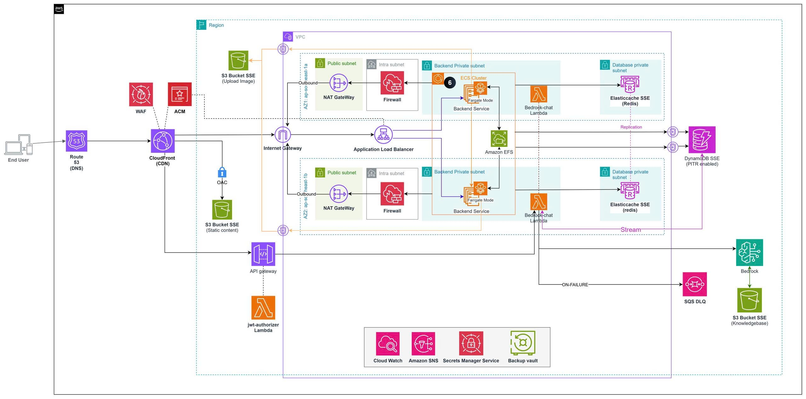

# Kicks Shoes — E-commerce & AI Assistant Platform

Full-stack e-commerce application for selling sneakers and lifestyle apparel, built with **React** (frontend), **Node.js/Express** (backend), and deployed as a highly available, serverless-first microservices architecture on **AWS** via **Terraform**.

The platform features an integrated **AI Assistant** using Amazon Bedrock for intelligent product recommendations and customer support.

---

## AWS Cloud Architecture




### Core AWS Components & Services
Hệ thống được thiết kế theo tiêu chuẩn Well-Architected Framework của AWS, tập trung vào tính Bảo mật, Khả năng mở rộng và Tối ưu chi phí (FinOps):

1. **Networking & Security (Network Fortress)**
   - **Amazon VPC (Multi-AZ):** Thiết kế mạng 3 lớp (Public, Private, Intra subnets) trải dài trên 2 Availability Zones để triệt tiêu điểm lỗi đơn lẻ (SPOF).
   - **AWS Network Firewall:** Kiểm soát toàn bộ traffic đi ra ngoài (Egress) bằng Domain Allowlist.
   - **VPC Flow Logs:** Giám sát toàn bộ luồng mạng phục vụ cho bảo mật và audit.

2. **Compute & Routing**
   - **Amazon CloudFront:** Mạng lưới phân phối nội dung (CDN) toàn cầu để host React Frontend tốc độ cao.
   - **Application Load Balancer (ALB):** Phân phối tải thông minh đến các container backend.
   - **Amazon API Gateway (HTTP API):** Cổng API bảo vệ bởi JWT Authorizer, xử lý giao tiếp an toàn cho hệ thống Chat AI.
   - **Amazon ECS (AWS Fargate):** Môi trường chạy Container serverless cho Node.js Backend, không cần quản lý máy chủ vật lý.

3. **Database & Storage**
   - **Amazon S3:** Lưu trữ hình ảnh sản phẩm tĩnh. Được bảo vệ bởi KMS CMK Encryption và Block Public Access.
   - **Amazon DynamoDB:** Cơ sở dữ liệu NoSQL với độ trễ mili-giây, lưu trữ lịch sử hội thoại Chat AI (pk/sk schema).
   - **AWS Backup:** Lập lịch tự động sao lưu dữ liệu cho DynamoDB và S3 hàng ngày.

4. **Artificial Intelligence (AI/LLM)**
   - **Amazon Bedrock (Knowledge Base):** Hệ thống RAG (Retrieval-Augmented Generation) cung cấp AI tư vấn giày thông minh dựa trên dữ liệu thật của Kicks Shoes.
   - **AWS Lambda (bedrock-chat):** Hàm serverless xử lý logic chat AI, kích hoạt thông qua luồng sự kiện DynamoDB Streams hoặc trực tiếp từ API Gateway.

5. **FinOps & Auto-Remediation (Operations)**
   - **Lambda Cost Guard:** Cơ chế "Smart Wake-up" tiết kiệm 80% chi phí. Tự động tắt hệ thống ECS (Scale về 0) ban đêm và bật lại lúc 8h sáng, liên kết chặt chẽ với AWS Budgets để tự động ngừng chạy nếu tiêu lố ngân sách.
   - **Lambda Security Guard:** Cơ chế tự phục hồi (Self-Healing). Kích hoạt ngay lập tức qua EventBridge & CloudTrail nếu có ai đó vô tình tắt bảo mật S3, và tự động khóa lại an toàn trong vòng 1 phút.
   - **CloudWatch Dashboards & Alarms:** Cung cấp khả năng quan sát toàn diện (Observability) và giám sát lỗi thông minh bằng Custom Metrics.

---

## Project Structure

```
kicks-shoes/
├── frontend/                   # React + Vite SPA
│   ├── src/
│   │   ├── assets/             # Images, SVGs, static files
│   │   ├── components/         # Reusable UI components
│   │   ├── pages/              # Page-level components
│   │   └── ...                 # Config, contexts, hooks, services
│   ├── index.html
│   ├── vite.config.js
│   └── package.json
│
├── backend/                    # Node.js + Express REST API
│   ├── src/
│   │   ├── config/             # DB, S3, Cloudinary configs
│   │   ├── controllers/        # Route handler logic
│   │   ├── models/             # Mongoose models
│   │   ├── routes/             # Express route definitions
│   │   └── app.js              # Express app entry point
│   ├── lambda/
│   │   ├── bedrock-chat/       # AWS Lambda: AI chat processor
│   │   ├── cost-guard/         # AWS Lambda: FinOps Scale down/up
│   │   └── security-guard/     # AWS Lambda: S3 Self-Healing
│   ├── Dockerfile              # Production Docker image
│   └── package.json
│
├── infra/                      # Infrastructure as Code
│   └── terraform/              
│       ├── environments/       # Multi-env (dev, prod)
│       └── modules/            # Reusable Terraform modules (alb, ecs, dynamodb, network...)
│
├── docs/                       # Project documentation
│   ├── aws/                    # Deployment guides
│   ├── weekly/                 # Weekly progress reports (W1-W6)
│   └── images/                 # Architecture diagrams and screenshots
│
└── .github/
    └── workflows/              # GitHub Actions CI/CD pipelines
```

---

## Prerequisites

- Node.js v18+
- MongoDB
- Terraform v1.5+
- AWS CLI configured with proper IAM permissions

## Quick Start (Local Development)

### Install all dependencies
```bash
npm run install-all --legacy-peer-deps
```

### Run in development
```bash
npm run dev
```
This starts both frontend (`http://localhost:5173`) and backend (`http://localhost:5000`) concurrently.

### Run separately
```bash
# Backend only
npm run server

# Frontend only
npm run client
```

---

## Environment Variables

Copy the example files and fill in your values:

```bash
cp backend/.env.example backend/.env
cp frontend/.env.example frontend/.env
```

Key backend variables:

| Variable | Description |
|---|---|
| `MONGODB_URI` | MongoDB connection string |
| `JWT_SECRET` | JWT signing secret |
| `PORT` | Server port (default: 5000) |
| `AWS_REGION` | AWS region |
| `DYNAMODB_TABLE_NAME` | DynamoDB table name |
| `BEDROCK_KB_ID` | Bedrock Knowledge Base ID |

---

## Tech Stack

### Frontend
- React 18, Vite, React Router v6
- Redux Toolkit + Redux Persist
- Ant Design, TailwindCSS
- Socket.IO Client, Axios, TanStack Query

### Backend
- Node.js, Express
- MongoDB + Mongoose, Socket.IO
- AWS SDK (S3, DynamoDB, Bedrock, CloudWatch)

### Cloud Infrastructure & DevOps
- **Compute:** AWS ECS Fargate, Lambda
- **Network:** VPC, ALB, CloudFront, API Gateway, Network Firewall
- **Storage/DB:** S3, DynamoDB, ElastiCache (Redis)
- **Security & Ops:** KMS, CloudWatch, CloudTrail, AWS Budgets, AWS Backup
- **IaC:** Terraform
- **CI/CD:** GitHub Actions, Docker

---

## Available Scripts (root)

| Script | Description |
|---|---|
| `npm run dev` | Start frontend + backend concurrently |
| `npm run server` | Start backend only |
| `npm run client` | Start frontend only |
| `npm run lint` | Lint both frontend and backend |
| `npm run format` | Format all files with Prettier |
| `npm run security:scan` | Run security audit |
| `npm run install-all` | Install all dependencies |
