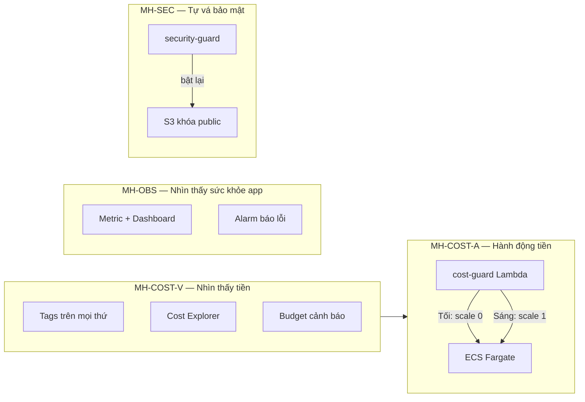

# W6 — Nền tảng cho người mất gốc (Đọc file này TRƯỚC)

> Nếu bạn chưa làm W1–W5 hoặc chưa hiểu VPC/Lambda/ECS là gì, **bắt đầu tại đây**.  
> Sau khi đọc xong, chuyển sang [README.md](./README.md) → [w6_must_haves_mapping.md](./w6_must_haves_mapping.md).

---

## 1. Tuần 6 là gì? (Một câu)

**Tuần 6 = chứng minh app đã chạy trên AWS có thể *vận hành an toàn*: biết tiền, cắt tiền, theo dõi sức khỏe, tự vá lỗi bảo mật.**

Không code tính năng mới (không thêm giỏ hàng, không đổi UI). Chỉ thêm **lớp vận hành** lên stack cũ.

---

## 2. Bạn cần nhớ gì từ W1–W5? (Tóm tắt 2 phút)

| Tuần | Bạn đã có trên AWS | Ví von |
|------|-------------------|--------|
| W1–W2 | VPC, ECS chạy backend | Tòa nhà + phòng server chạy app |
| W3 | ALB, CloudFront, FE | Cổng vào + CDN phục vụ web |
| W4 | Cognito, Secrets | Thẻ nhân viên + két mật khẩu |
| W5 | Firewall, API Gateway, S3, Backup | Kiểm lâm + cổng API AI + kho lưu trữ + sao lưu |

W6 **không xây lại tòa nhà** — chỉ gắn thêm: đồng hồ đo tiền, báo động, robot tắt máy, robot khóa S3.

---

## 3. AWS tính tiền thế nào? (Cực quan trọng cho W6)

AWS **không** bán “một gói cố định” cho hầu hết dịch vụ workshop. Bạn trả theo:

| Kiểu | Nghĩa | Ví dụ Kicks Shoes |
|------|--------|-------------------|
| **Theo giờ** | Bật 24/7 = trả 24/7 | NAT Gateway, Network Firewall endpoint, ElastiCache |
| **Theo lần dùng** | Chỉ trả khi gọi API | Lambda (mili-giây chạy), API Gateway request |
| **Theo dung lượng** | GB lưu trữ / transfer | S3, CloudFront data out |
| **Theo tháng cố định** | Phí tối thiểu | KMS key ~$1/tháng |

**Budget $150** = ngưỡng cảnh báo: “Sắp/vượt $150 tháng này” — **không tự khóa thẻ** trừ khi bạn tự viết automation (cost-guard).

---

## 4. Bốn trụ cột W6 — Giải thích như đời thường



| Trụ | Câu hỏi trả lời | Không làm thì sao? |
|-----|------------------|-------------------|
| **COST-V** | Tháng này đốt bao nhiêu? Ai chịu trách nhiệm? | Không biết service nào đắt → vượt $150 |
| **COST-A** | Tự động tắt ECS Fargate khi không dùng? | App chạy rỗng ban đêm → cháy tiền compute |
| **OBS** | App chậm/lỗi ở đâu? | Không biết Bedrock chậm hay ECS sập |
| **SEC** | Ai mở S3 public có tự khóa lại? | Lộ ảnh khách hàng |

---

## 5. Thuật ngữ W1–W6 cần cho W6 (mở rộng)

### 5.1 Hạ tầng & app (đã có từ W5)

| Thuật ngữ | Định nghĩa dễ hiểu |
|-----------|-------------------|
| **ECS Fargate** | Chạy container backend **không cần thuê server EC2** — AWS lo máy. |
| **ALB** | Cân bằng tải — phân phối request HTTP tới container. |
| **CloudFront** | CDN — cache/static + HTTPS cho user gần edge. |
| **API Gateway** | Cổng HTTP cho Lambda — route `/chat`, throttle, JWT. |
| **Lambda** | Hàm chạy khi có sự kiện — trả tiền theo ms chạy. |
| **DynamoDB / MongoDB** | Database — lưu chat, sản phẩm. |
| **S3** | Kho file — ảnh upload giày. |
| **Secrets Manager** | Két chứa JWT, MongoDB password — app đọc lúc chạy. |

### 5.2 Chỉ xuất hiện / quan trọng ở W6

| Thuật ngữ | Định nghĩa dễ hiểu | Ví von |
|-----------|-------------------|--------|
| **Tag** | Nhãn dán trên resource: `Owner`, `Application`… | Nhãn hành lý trên vali |
| **Cost allocation tag** | Tag dùng **chia bill** trong Cost Explorer — phải **Activate** 1 lần | Bật “đếm theo nhãn” trên hóa đơn |
| **AWS Budgets** | Báo khi chi phí > X% ngưỡng | Còi báo khi tiền điện > 80% hạn mức |
| **SNS Topic** | Kênh phát tin — nhiều người đăng ký nhận | Nhóm Zalo thông báo |
| **EventBridge Scheduler** | Hẹn giờ gọi Lambda (cron) | Báo thức 20:00 mỗi ngày |
| **CloudWatch Metric** | Con số theo thời gian (CPU %, latency ms) | Nhiệt kế, đồng hồ đo |
| **CloudWatch Alarm** | Chuông khi số vượt ngưỡng | Báo sốt khi > 38°C |
| **Log / Log Insights** | Nhật ký chữ — query như SQL đơn giản | Camera ghi lại + tua lại tìm lỗi |
| **CloudTrail** | Sổ ghi **ai gọi API AWS lúc nào** | Camera an ninh cửa API |
| **Block Public Access (BPA)** | 4 nút khóa S3 không cho internet đọc | Khóa 4 ổ khóa cửa kho |
| **KMS CMK** | Chìa khóa mã hóa do bạn sở hữu | Két sắt riêng, có biên bản mở khóa |

---

## 6. EC2, RDS, Lambda — Khác nhau thế nào? (Hay nhầm)

| | **EC2** | **RDS** | **Lambda** |
|--|---------|---------|------------|
| Là gì | Serverless Container | Serverless Function |
| Trả tiền khi | Chạy (running tasks) | Mỗi lần invoke |
| cost-guard làm gì | **Scale count = 0** | **Không** stop Lambda |
| Kicks Shoes dùng? | Web app Backend | cost-guard + security-guard + bedrock |

**Scale 0 ≠ Delete (Terminate):**
- **Scale 0** = Dừng container, không tốn compute, giữ nguyên code, sáng bật lại nhanh chóng.

---

## 7. Luồng dữ liệu — Một request từ user đến Bedrock

Giúp bạn hiểu **OBS** đo cái gì:

```
User mở FE (CloudFront)
    → gọi API backend (CloudFront → ALB → ECS)     ← metric ECS CPU
    → hoặc gọi /chat (API Gateway → Lambda)       ← metric BedrockQueryLatencyMs
         → Lambda đọc JWT, gọi Bedrock AI
         → ghi DynamoDB
```

**Custom metric** = Lambda tự báo “lần này Bedrock mất X ms” lên CloudWatch.

---

## 8. Luồng tiền & cost-guard (chi tiết từng bước)

### 💡 Bối cảnh E-commerce (Tại sao phải Scale 0 ban đêm?)
Kicks-Shoes là một dự án E-commerce tích hợp AI đang trong giai đoạn phát triển (**Môi trường DEV**). Ở môi trường DEV, team Developer chỉ code và test hệ thống vào giờ hành chính. Tuy nhiên, nếu cứ để Serverless Container (ECS Fargate) chạy 24/7, dự án sẽ "đốt" tiền vô ích vào ban đêm và cuối tuần. 
Do đó, chúng ta cần một cơ chế **Smart Wake-up (Thức dậy thông minh)**:
- **Tối (20:00 UTC):** Lambda dọn dẹp, ép số lượng container về 0.
- **Sáng (01:00 UTC):** Lambda kiểm tra hóa đơn (Budgets). Nếu tiền chưa vượt ngưỡng $150, nó sẽ dựng container (Scale = 1) trở lại để team Dev vào làm việc bình thường. Nếu đã vượt $150, nó kiên quyết để hệ thống "ngủ" luôn nhằm bảo vệ túi tiền.

### 8.1 Chỉ nhìn (COST-V)

1. Mọi resource có **tag** `Application=KicksShoes`, `CostCenter=G13`…
2. Bạn vào **Cost Explorer** → group theo Service → thấy NAT, Firewall, ECS đắt nhất.
3. **Budget** $150/tháng → 80% gửi SNS (email/Lambda).

### 8.2 Nhìn + hành động (COST-A)

**Trigger A — Lịch Tối (20:00 UTC mỗi ngày):**
```
EventBridge Scheduler → gọi cost-guard Lambda (source: scheduled-night)
    → khóa Auto Scaling (Min=0)
    → ép số lượng container chạy xuống 0 (DesiredCount=0)
```

**Trigger B — Lịch Sáng (01:00 UTC mỗi ngày):**
```
EventBridge Scheduler → gọi cost-guard Lambda (source: scheduled-morning)
    → Đọc AWS Budgets (hạn mức $150)
    → Nếu vượt $150: Dừng, không bật.
    → Nếu an toàn: Mở Auto Scaling (Min=1) và Bật lại Container (DesiredCount=1).
```

**Trigger C — Budget vượt ngưỡng (Bất cứ lúc nào trễ 8–24h):**
```
Budget → SNS topic alerts → Lambda cost-guard (logic tắt giống Trigger A)
```

---

## 9. Luồng bảo mật — security-guard (từng bước)

1. Admin **lỡ** tắt Block Public Access trên bucket uploads.
2. Hành động ghi vào **CloudTrail**.
3. **EventBridge** rule thấy event S3 → gọi **security-guard** Lambda.
4. Lambda gọi API **bật lại 4 khóa** BPA.
5. Evidence: screenshot Before (public) / After (blocked) + CloudTrail `PutPublicAccessBlock`.

**KMS CMK** = file upload trên S3 được mã hóa bằng **chìa khóa riêng** — CloudTrail ghi mỗi lần S3 “xin chìa” (`GenerateDataKey`).

---

## 10. INSUFFICIENT_DATA là gì? (Hay gặp khi làm OBS)

CloudWatch Alarm cần **đủ điểm dữ liệu** trong khoảng thời gian (ví dụ 2 period × 5 phút).

| Trạng thái | Ý nghĩa | Mentor chấp nhận? |
|------------|---------|-------------------|
| **OK** | Bình thường | ✅ |
| **ALARM** | Vượt ngưỡng | ✅ |
| **INSUFFICIENT_DATA** | Chưa có metric / chưa ai gọi app | ❌ |

**Cách fix:** Trước Friday — mở FE, gọi API, invoke Lambda bedrock vài lần → đợi 10–15 phút → alarm chuyển OK hoặc ALARM.

---

## 11. Terraform, zip Lambda, apply — Thứ tự cho người mới

```
1. Sửa code Python (cost-guard / security-guard)
2. Nén zip: Compress-Archive index.py → cost-guard.zip
3. cd infra/terraform/environments/dev/02-app
4. terraform init (lần đầu hoặc đổi backend)
5. terraform plan -var-file=terraform.tfvars
6. terraform apply
7. AWS Console verify (Lambda, Budget, Dashboard)
8. Demo + chụp screenshot → docs/W6_evidence.md
```

**Vì sao cần zip?** Terraform **không** build code giúp bạn — nó chỉ upload file `.zip` có sẵn lên Lambda.

### 💡 [Deep-Dive] Terraform làm gì khi ta xóa EFS và cập nhật hệ thống?
Khi chạy lệnh `terraform apply` để gỡ bỏ ổ đĩa EFS, Terraform không "mù quáng" xóa bừa bãi. 
Nó đối chiếu **Terraform State** (File trạng thái ghi nhớ những gì đã tạo tuần trước) với cấu hình mới nhất trong code. 
- Nó nhận ra bạn đã xóa khối `aws_efs_file_system` trong code, nên nó sẽ tính toán: *"Cần phải xóa ổ EFS trên AWS, đồng thời xóa luôn 2 Mount Targets và Security Group liên quan"*. 
- Quá trình này mất khoảng 1-3 phút vì AWS cần đảm bảo không có container nào đang ghi dữ liệu trước khi thực sự "rút phích cắm" ổ đĩa cứng mạng đó. Việc này thể hiện sức mạnh của **Infrastructure as Code (IaC)**: Sạch sẽ, không để lại rác (orphan resources), và quản lý phụ thuộc (dependencies) chuẩn xác!

---

## 12. Lộ trình đọc đề xuất (mất gốc)

| Bước | File | Thời gian ước tính |
|------|------|-------------------|
| 1 | **w6_foundations.md** (file này) | 30–45 phút |
| 2 | [README.md](./README.md) | 10 phút |
| 3 | [w6_must_haves_mapping.md](./w6_must_haves_mapping.md) — làm COST | 1–2 giờ + thực hành |
| 4 | [w6_must_haves_part2.md](./w6_must_haves_part2.md) — OBS + SEC | 1–2 giờ + thực hành |
| 5 | **[w6_manual_console_setup.md](./w6_manual_console_setup.md)** | **30 - 45 phút thực hành Console** |
| 6 | [w6_full_knowledge_part1.md](./w6_full_knowledge_part1.md) | Ôn / trước quiz |
| 7 | [w6_full_knowledge_part2.md](./w6_full_knowledge_part2.md) | Ôn / trước quiz |

Nếu đã có kinh nghiệm AWS: bỏ qua bước 1, đọc README → must_haves.

---

## 13. FAQ — Câu hỏi hay gặp

**H: W6 có phải deploy lại toàn bộ không?**  
Đ: Không. Chủ yếu `terraform apply` layer **02-app** thêm file W6. Network (01) chỉ cần tags đồng bộ nếu mentor yêu cầu.

**H: Budget daily $150 hay monthly?**  
Đ: Đề có thể ghi daily; repo Kicks Shoes dùng **monthly $150**. Evidence: giải thích 1 câu trong ADR.

**H: cost-guard có tắt ECS/Fargate không?**  
Đ: **Có** — Hệ thống Kicks-Shoes đã được nâng cấp (Bonus Optimized) để tự động scale ECS Fargate về 0 nhằm tiết kiệm tiền triệt để.

**H: Activate tag xong mà Cost Explorer vẫn trống?**  
Đ: Đợi **24h**. Tag chỉ áp dụng cho cost **phát sinh sau** khi activate.

**H: FE gọi BE bằng URL nào?**  
Đ: `VITE_API_BASE_URL` → CloudFront backend `.../api`. Bedrock trực tiếp: `VITE_BEDROCK_API_URL` → API Gateway.

**H: Demonstrable nghĩa là gì?**  
Đ: Mentor muốn **ảnh + log + CloudTrail** thật — không chấp nhận “em đã làm” không có proof.

---

## 14. Checklist “tôi đã hiểu nền tảng”

- [ ] Giải thích được W6 khác W5 thế nào (vận hành vs tính năng mạng)
- [ ] Kể được 4 MH bằng lời của mình
- [ ] Phân biệt Serverless Fargate / Lambda và cách cost-guard tác động
- [ ] Hiểu khái niệm Scale về 0 thay vì Stop EC2
- [ ] Vẽ được luồng Budget → SNS → Lambda
- [ ] Biết vì sao alarm có thể INSUFFICIENT_DATA và cách fix
- [ ] Biết CloudTrail dùng để làm evidence gì

Khi tick đủ → sang [w6_must_haves_mapping.md](./w6_must_haves_mapping.md).
