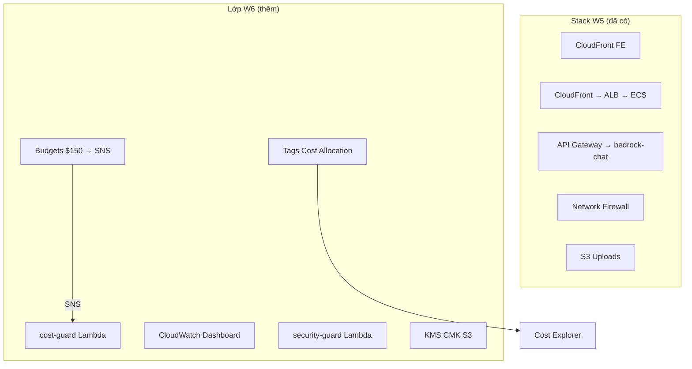
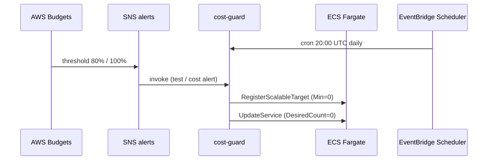

# Cẩm nang AWS Tuần 6 — Phần 1: Thuật ngữ, MH-COST-V & MH-COST-A

> Tài liệu chia làm 2 phần. Phần 1: **Bảng Thuật Ngữ**, nền tảng W6, **MH-COST-V** (Cost Visibility) và **MH-COST-A** (Cost Control).  
> 👉 [Xem Phần 2: MH-OBS, MH-SEC & Evidence](./w6_must_haves_part2.md)

> [!TIP] **Mất gốc?** Đọc trước [w6_foundations.md](./w6_foundations.md) (30–45 phút) — giải thích AWS billing, EC2 vs Lambda, 4 MH bằng ngôn ngữ đời thường.

---

## 📖 Bảng Định Nghĩa Thuật Ngữ AWS (Glossary W6)

> Cột **Ví von** giúp nhớ lâu; cột **Ví dụ** giúp tìm trên Console/CLI.

| Thuật ngữ | Định nghĩa dễ hiểu | Ví von | Ví dụ trong dự án |
| :--- | :--- | :--- | :--- |
| **Tag** | Cặp `Key=Value` dán lên mọi AWS resource để tìm & chia bill | Nhãn hành lý trên vali | `Environment=dev` |
| **Cost Allocation Tag** | Tag dùng **chia hóa đơn** trong Cost Explorer. Phải **Activate** trên Billing (chờ ~24h). | Bật “tính tiền theo nhãn” trên sao kê | `Owner`, `Application`, `CostCenter` |
| **AWS Budgets** | Cảnh báo khi chi phí **vượt ngưỡng** ($ hoặc %). Gửi SNS — **không** tự tắt máy (trừ khi nối SNS → Lambda). | Còi báo 80% hạn mức điện | `kicks-shoes-dev-tientp-monthly-150-cap` |
| **Cost Anomaly Detection** | ML phát hiện bill **bất thường** (vd tăng đột biến NAT). | Bảo vệ gia tăng bất ngờ | *(tùy chọn)* |
| **Cost Guard Lambda** | Robot **scale Fargate về 0** để tiết kiệm compute. | Timer tắt máy phòng lab | `kicks-shoes-dev-tientp-cost-guard` |
| **EventBridge Scheduler** | Hẹn giờ gọi Lambda (cron), không cần server bật 24/7. | Báo thức 20:00 | `cron(0 20 * * ? *)` |
| **SNS Topic** | Kênh phát tin — Budget, alarm, test đều có thể gửi vào đây. | Nhóm chat thông báo | `...-alerts` |
| **CloudTrail** | Sổ audit: **ai** gọi API AWS **lúc nào** (UpdateService, PutPublicAccessBlock). | Camera cửa API | Event history |
| **UpdateService** | Lệnh ECS hạ số lượng container về 0 để tắt ứng dụng. | Cúp cầu dao điện | Demo MH-COST-A |
| **TerminateInstances** | Xóa hẳn EC2 — **mất data**. cost-guard **không** dùng. | Bán phế liệu | ❌ không dùng |
| **Custom Metric** | Số liệu app tự gửi (`PutMetricData`), vd latency Bedrock. | Đồng hồ đo tự lắp | `BedrockQueryLatencyMs` |
| **CloudWatch Dashboard** | Một trang gom nhiều biểu đồ. | Bảng điều khiển xe | `...-operations` |
| **INSUFFICIENT_DATA** | Alarm chưa đủ số đo → mentor **không** chấp nhận Friday. | Nhiệt kế chưa cắm pin | Xem foundations §10 |
| **Security Guard Lambda** | Robot S3: phát hiện public → khóa lại 4 BPA. | Khóa kho tự động | `...-security-guard` |
| **KMS CMK** | Chìa khóa mã hóa bạn sở hữu — audit được trên CloudTrail. | Két sắt riêng có sổ | `alias/...-s3-uploads` |
| **Block Public Access (BPA)** | 4 nút khóa S3 không cho internet đọc bucket. | 4 ổ khóa cửa kho | Uploads bucket |

---

## 0. Nền tảng: W6 trên stack W5 (Carry-forward)

> [!IMPORTANT]
> W6 **không rebuild** VPC, Firewall, API Gateway, EFS. W6 **bổ sung lớp vận hành** lên stack đã có.



### Kiến trúc chi phí (luồng MH-COST-A)



---

## 1. MH-COST-V — Cost Visibility & Attribution (Biết tiền đi đâu)

### 📚 Định nghĩa (cho người mới)

**Cost Visibility** = nhìn được hóa đơn cloud như sao kê thẻ:

| Câu hỏi | Trả lời bằng công cụ nào |
|---------|--------------------------|
| Tháng này đốt bao nhiêu? | Cost Explorer, Budget Actual |
| Service nào đắt nhất? | Cost Explorer → Group by **Service** |
| Team/app nào trả tiền? | Tag `Application`, `CostCenter` (sau Activate) |
| Sắp vượt $150? | Budget alert 80% / 100% → SNS |

**Hai bước tách biệt (hay nhầm):**
1. **Gắn tag** (Terraform) — dán nhãn lên resource.
2. **Activate tag** (Console, 1 lần) — bảo AWS “hãy dùng nhãn này để chia bill”.

### 🎯 Mục đích

| Vấn đề trước W6 | Sau W6 |
|-----------------|--------|
| Tags chỉ `Project`, `Environment`, `ManagedBy` | Thêm `Owner`, `CostCenter`, `Application` |
| Cost Explorer không filter theo app | Activate allocation tags → filter `Application=KicksShoes` |
| Không có ngưỡng cảnh báo | Budget $150/month → SNS |

### 💻 Code Terraform — Tags (giải thích từng khối)

**Bước 1 — Khai báo tag mặc định**  
File: `infra/terraform/environments/dev/02-app/variables.tf`

```hcl
variable "tags" {
  type = map(string)
  default = {
    Owner       = "team-lead@kicks-shoes.com"  # Ai chịu trách nhiệm bill
    CostCenter  = "G13"                         # Mã nhóm workshop
    Application = "KicksShoes"                  # Tên app — viết đúng chữ hoa
  }
}
```

**Bước 2 — Trộn tag chung cho mọi resource**  
File: `infra/terraform/environments/dev/02-app/main.tf`

```hcl
locals {
  common_tags = merge(var.tags, {           # merge = gộp map
    Project     = "kicks-shoes"
    Environment = "dev"                     # Bắt buộc đúng chữ thường "dev"
    ManagedBy   = "terraform"
  })
}
# Mỗi resource: tags = local.common_tags
```

**Bước 3 — Override cá nhân (optional)**  
File: `terraform.tfvars`

```hcl
tags = { Owner = "tientp" }
# CostCenter + Application vẫn lấy default — không cần ghi lại
```

**Sau `terraform apply`:** Vào ECS → Tags → phải thấy đủ 4 key mentor yêu cầu.

### 💻 Code Terraform — AWS Budgets

**File:** `infra/terraform/environments/dev/02-app/budgets.tf`

```hcl
resource "aws_budgets_budget" "monthly_cost_cap" {
  name         = "${var.project_name}-monthly-150-cap"
  budget_type  = "COST"
  limit_amount = "150"
  limit_unit   = "USD"
  time_unit    = "MONTHLY"   # Workshop doc ghi daily — team dùng MONTHLY cap $150

  notification {
    comparison_operator       = "GREATER_THAN"
    threshold                 = 80
    threshold_type            = "PERCENTAGE"
    notification_type         = "ACTUAL"
    subscriber_sns_topic_arns = [aws_sns_topic.alerts.arn]
  }
  # notification 100% tương tự
}
```

> [!WARNING]
> **Activate cost allocation tags** không làm được bằng Terraform. Bắt buộc thủ công:
> 1. **Billing** → **Cost allocation tags**
> 2. Tìm `Owner`, `Application`, `CostCenter` → **Activate**
> 3. Đợi **~24 giờ** mới có data trong Cost Explorer

### 🖥️ Cách xem TAG đã được gắn trên các Service chưa (AWS Console)

Bạn cần mở giao diện AWS Console của từng dịch vụ để kiểm tra xem 4 thẻ bắt buộc (`Owner`, `Environment`, `CostCenter`, `Application`) đã xuất hiện chưa:

**1. Trên ECS (Fargate Service):**
- Mở AWS Console &rightarrow; Tìm **ECS** &rightarrow; Chọn Cluster `kicks-shoes-dev-tientp-cluster`.
- Chuyển sang tab **Services** &rightarrow; Nhấn vào tên service `kicks-shoes-dev-tientp-service`.
- Cuộn xuống dưới cùng, chọn tab **Tags**. Bạn sẽ thấy danh sách các thẻ ở đây.

**2. Trên AWS Lambda (Cost Guard & Bedrock Chat):**
- Mở AWS Console &rightarrow; Tìm **Lambda** &rightarrow; Chọn function `kicks-shoes-dev-tientp-cost-guard`.
- Chọn tab **Configuration** (Cấu hình) &rightarrow; Nhìn menu bên trái chọn **Tags**.

**3. Trên S3 Bucket (Kho lưu trữ ảnh):**
- Mở AWS Console &rightarrow; Tìm **S3** &rightarrow; Bấm vào bucket `kicks-shoes-dev-tientp-962533717758-uploads`.
- Chọn tab **Properties** (Thuộc tính).
- Cuộn xuống tìm mục **Tags** (thường nằm ở nửa dưới trang).

**4. Trên Network Firewall:**
- Mở AWS Console &rightarrow; Tìm **VPC**.
- Ở menu bên trái, cuộn xuống mục **AWS Network Firewall** &rightarrow; Chọn **Firewalls**.
- Bấm vào tên Firewall của bạn, cuộn xuống dưới cùng tìm mục **Tags**.

*(Tất cả các tài nguyên này đều phải có đủ thẻ vì chúng ta đã dùng `local.common_tags` bao trùm toàn bộ code Terraform).*

### 🖥️ Cách xem cấu hình Smart Wake-up & Budgets trên AWS Console

Để minh chứng cho Trainer thấy hệ thống của bạn tự động "Ngủ - Thức" và giới hạn chi phí theo từng ngày/tháng, bạn hãy thao tác click như sau để chụp ảnh màn hình:

**1. Xem Lịch trình "Ngủ - Thức" (EventBridge Scheduler):**
- Mở AWS Console &rightarrow; Tìm **EventBridge**.
- Ở menu bên trái, dưới phần **Scheduler**, chọn **Schedules**.
- Bạn sẽ thấy 2 lịch trình:
  - `kicks-shoes-dev-tientp-cost-guard-daily`: Lịch ngủ buổi tối (Cron: `0 20 * * ? *`).
  - `kicks-shoes-dev-tientp-cost-guard-morning`: Lịch thức buổi sáng (Cron: `0 1 * * ? *`).
- Click vào từng lịch để xem phần Target đang gọi đến Lambda Cost Guard.

**2. Xem Cảnh báo Ngân sách (AWS Budgets):**
- Mở AWS Console &rightarrow; Tìm **Billing** (hoặc Billing and Cost Management).
- Ở menu bên trái, dưới phần **Cost management**, chọn **Budgets**.
- Bạn sẽ thấy 2 Budget đang chạy song song để bảo vệ túi tiền của bạn nhiều lớp:
  - `kicks-shoes-dev-tientp-monthly-150-cap`: Chặn mức 150$ cho nguyên tháng.
  - `kicks-shoes-dev-tientp-daily-10-cap`: Chặn mức 10$ cho từng ngày (Chống "cháy tiền" đột ngột trong 24h).
- Click vào từng Budget để xem Actual vs Budgeted và biểu đồ thanh cảnh báo 80%, 100%.

### 🖥️ Cách xem Cost Explorer (Sau khi tag có hiệu lực)

1. **Cost Explorer** &rightarrow; Group by **Service** &rightarrow; Filter tag `Application = KicksShoes` (Chỉ làm được sau khi Activate Cost Allocation Tags 24h).

### ✅ Verify CLI

```powershell
# Budget tồn tại
aws budgets describe-budget --account-id 962533717758 `
  --budget-name kicks-shoes-dev-tientp-monthly-150-cap

# Chi phí tháng hiện tại (ước lượng)
aws ce get-cost-and-usage `
  --time-period Start=2026-05-01,End=2026-05-21 `
  --granularity MONTHLY --metrics BlendedCost
```

### 📋 Checklist MH-COST-V

- [ ] `terraform apply` — tags xuất hiện trên ECS, Lambda, S3, Firewall
- [ ] Activate allocation tags trên Billing Console
- [ ] Screenshot Cost Explorer (top 3 cost drivers)
- [ ] Viết 1 đoạn observation (NAT, Firewall endpoint, ECS thường đắt nhất)

---

## 2. MH-COST-A — Cost Control & Action (Tự động cắt chi phí)

### 📚 Định nghĩa (cho người mới)

**Cost Control** = sau khi **biết** tiền (COST-V), hệ thống **tự làm gì đó** để giảm bill:

| Hành động | Ai làm | Khi nào |
|-----------|--------|---------|
| Gửi cảnh báo | AWS Budgets → SNS | Vượt 80% / 100% ngưỡng $150 |
| Tắt hệ thống (Scale 0) | cost-guard Lambda | 20:00 UTC mỗi ngày **hoặc** khi SNS báo lố tiền |
| Bật hệ thống (Scale 1) | cost-guard Lambda | 01:00 UTC (Sáng) **VÀ** Budget < $150 |

### 🎯 Logic cost-guard (đọc như flowchart)

```
Bắt đầu
  → Nhận trigger từ EventBridge hoặc SNS
  → Nếu là (Buổi tối) HOẶC (SNS cảnh báo hết tiền):
       → Gọi API RegisterScalableTarget để set MinCapacity = 0
       → Gọi API UpdateService để set DesiredCount = 0
  → Nếu là (Buổi sáng):
       → Check hóa đơn (AWS Budgets)
       → Đã xài lố $150? → Thoát, không bật!
       → Chưa lố $150? → Set MinCapacity = 1, DesiredCount = 1
  → Ghi log kết quả
```

| Resource | Hành động | Mục đích |
|----------|----------------|----------------|
| ECS Fargate | `UpdateService (DesiredCount=0)` | Dừng toàn bộ web app để không tốn tiền compute ban đêm. |
| Application Auto Scaling | `RegisterScalableTarget (Min=0)` | Ngăn chặn Auto Scaling tự động đẩy container lên lại. |

**Ví dụ:** Thay vì đi tìm EC2 để tắt như cách cũ, hệ thống 100% Serverless của chúng ta sẽ tự động "rút phích cắm" của các container Fargate lúc 20:00 UTC. Sáng hôm sau cần test, bạn chỉ việc gõ `terraform apply` để đẩy lên lại.

### 💻 Lambda Code

**File:** `backend/lambda/cost-guard/index.py`

- Trigger 1: EventBridge Scheduler `cron(0 20 * * ? *)`
- Trigger 2: SNS từ Budgets (cùng topic `alerts`)

Build zip trước `terraform apply`:

```powershell
Compress-Archive -Path backend/lambda/cost-guard/index.py `
  -DestinationPath backend/lambda/cost-guard/cost-guard.zip -Force
```

### 💻 Terraform — cost-guard.tf (tóm tắt)

| Resource | Vai trò |
|----------|---------|
| `aws_lambda_function.cost_guard` | Python 3.12, zip từ repo |
| `aws_scheduler_schedule.cost_guard_daily` | 20:00 UTC |
| `aws_sns_topic_subscription.budgets_to_cost_guard` | SNS → Lambda |
| `aws_iam_role_policy.cost_guard_actions` | `ecs:UpdateService`, `application-autoscaling`, `budgets:ViewBudget` |

> [!NOTE]
> Đường dẫn zip từ `02-app`: **`../../../../../backend/lambda/...`** (5 cấp lên repo root), không phải 4 cấp.

---

### 💡 [Deep-Dive] Phân tích chuyên sâu: Tại sao lại Scale Fargate thay vì tắt EC2?
*(Dành cho các thành viên muốn hiểu sâu để giải trình với Mentor)*

**1. Khác biệt cốt lõi giữa Server-based và Serverless:**
Trong các kiến trúc cũ (Server-based), ứng dụng chạy trên máy ảo EC2. Nếu muốn không tốn tiền ban đêm, bạn đơn giản là gửi lệnh `StopInstances` để tắt nguồn máy chủ. 
Tuy nhiên, dự án Kicks-Shoes của chúng ta xịn hơn, chúng ta dùng **ECS Fargate (100% Serverless)**. AWS tự quản lý máy chủ bên dưới, bạn không có máy ảo EC2 nào để "tắt". Cách duy nhất để ngừng trả tiền là báo với AWS: *"Bây giờ tôi không cần container nào chạy nữa"*, tức là đưa số lượng container (Desired Count) về `0`.

**2. Vấn đề của Auto Scaling (Tại sao không chỉ set DesiredCount = 0?):**
ECS của chúng ta được gắn với Application Auto Scaling. Nếu Lambda chỉ đơn thuần gửi lệnh `UpdateService(DesiredCount=0)`, thì chưa đầy 1 phút sau, Auto Scaling sẽ phát hiện số lượng container đang dưới mức tối thiểu (`MinCapacity=1`), và nó sẽ... tự động tạo container mới đắp vào! 
👉 **Cách xử lý triệt để của nhóm:** Lambda của chúng ta thông minh hơn. Nó phải thực hiện **2 bước**:
- **Bước 1:** Khóa miệng Auto Scaling bằng lệnh `RegisterScalableTarget(MinCapacity=0)`.
- **Bước 2:** Xóa sổ container bằng lệnh `UpdateService(DesiredCount=0)`.

---

### 💡 [Deep-Dive] Phân tích chuyên sâu: Tại sao lại Xóa EFS và dùng S3 Lifecycle?

**1. Bài toán rò rỉ chi phí (Cost Leakage):**
Trong môi trường Cloud, lưu trữ EFS cực kỳ đắt đỏ (**$0.30/GB/Tháng**), đắt gấp 13 lần so với S3 Standard (**$0.023/GB/Tháng**). 
Thêm nữa, mỗi lần ứng dụng từ ECS đẩy ảnh lên EFS, dữ liệu có thể phải đi vòng qua NAT Gateway (nếu không setup VPC Endpoint cực kỳ chuẩn xác), gây phát sinh thêm chi phí data processing. 

**2. FinOps - Tối ưu Dòng tiền Dài hạn (Stretch Goal):**
Bằng việc loại bỏ hoàn toàn EFS, hệ thống được giảm tải. Thay vào đó, chúng ta lưu trữ trên S3 và áp dụng nguyên lý **Cloud-Native FinOps** thông qua `lifecycle_rule`:
- 30 ngày đầu: Ảnh nằm ở Standard (tốc độ cao).
- Sau 30 ngày: Ảnh ít được xem, tự động chuyển sang `STANDARD_IA` (Chỉ còn **$0.0125/GB/Tháng**).
- Sau 90 ngày: Tự động xóa (Expiration).
👉 Chiến lược này giúp nhóm tiết kiệm đến **80% chi phí lưu trữ dài hạn** mà không cần con người can thiệp thủ công. Minh chứng đanh thép cho kỹ năng Vận Hành Đám Mây (Cloud Operations)!

---

### 🖥️ Demo bắt buộc (Evidence)

**Bước 1 — Kiểm tra trạng thái ECS trước khi tắt:**

```powershell
aws ecs describe-services --cluster kicks-shoes-dev-tientp-cluster --services kicks-shoes-dev-tientp-service --query "services[0].desiredCount"
# Phải hiển thị >= 1
```

**Bước 2 — Invoke Lambda:**

```powershell
aws lambda invoke --function-name kicks-shoes-dev-tientp-cost-guard `
  --payload '{"source":"manual-demo"}' --region us-east-1 out.json
Get-Content out.json
```

**Bước 3 — Xác nhận kết quả & CloudTrail:**
Chạy lại lệnh ở Bước 1, kết quả phải ra `0`.
Vào CloudTrail Event history → filter `UpdateService` → screenshot minh chứng.

**Bước 4 — Test SNS chain:**

```powershell
$topic = aws sns list-topics --query "Topics[?contains(TopicArn,'alerts')].TopicArn" --output text
aws sns publish --topic-arn $topic --message "W6 budget test" --region us-east-1
```

### 📋 ADR — Cost data latency (viết ngắn)

Budget dùng **Actual cost** có độ trễ **8–24 giờ**. Trong workshop 48h, alert cost-driven có thể **không kịp fire** — chấp nhận được nếu:
- Wire SNS → Lambda đã có (Terraform)
- Test bằng SNS publish thủ công
- Ghi ADR giải thích latency

### ✅ Verify đã deploy

```powershell
aws lambda get-function --function-name kicks-shoes-dev-tientp-cost-guard --region us-east-1
aws scheduler get-schedule --name kicks-shoes-dev-tientp-cost-guard-daily --group-name default --region us-east-1
```

### 📋 Checklist MH-COST-A

- [ ] Lambda + Scheduler + SNS subscription Active
- [ ] Demo Scale Fargate về 0 → CloudTrail evidence (`UpdateService`)
- [ ] Test SNS → Lambda invoke thành công
- [ ] ADR cost-data latency (1 đoạn trong evidence pack)

---

> 👉 **Tiếp tục Phần 2:** [MH-OBS, MH-SEC, Evidence Pack & URL deploy](./w6_must_haves_part2.md)
