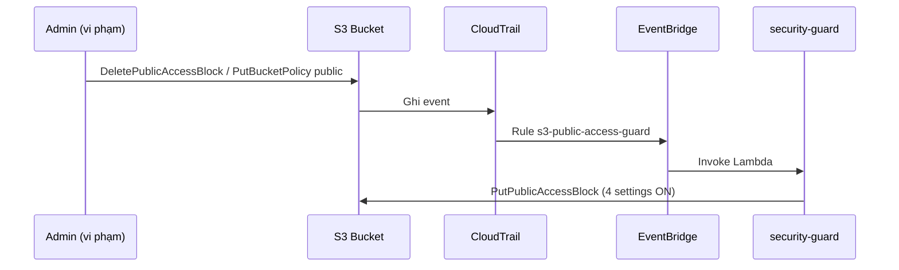

# Cẩm nang AWS Tuần 6 — Phần 2: MH-OBS, MH-SEC & Evidence

> 👉 [Xem lại Phần 1: Thuật ngữ, MH-COST-V & MH-COST-A](./w6_must_haves_mapping.md)  
> 👉 Chưa hiểu Metric / CloudTrail / S3 public? [w6_foundations.md](./w6_foundations.md) §5–§10

---

## 3. MH-OBS — Monitoring (Quan sát hệ thống)

### 📚 Monitoring là gì? (một phút cho người mới)

Khi app chạy trên cloud, bạn không ngồi cạnh server. **Monitoring** = trả lời 3 câu từ xa:

| Câu | Công cụ W6 |
|-----|------------|
| App còn sống không? | Health `/api/health`, ECS running count |
| Chậm ở đâu? | Custom metric `BedrockQueryLatencyMs`, access log `responseLatency` |
| Lỗi gì? | Lambda Errors alarm, Log Insights filter `ERROR` |

**Metrics** = con số theo thời gian (như nhiệt độ).  
**Logs** = văn bản chi tiết (như nhật ký). W6 cần **cả hai**.

### 📚 Định nghĩa Thuật ngữ (có ví von)

| Khái niệm | Định nghĩa | Ví von |
| :--- | :--- | :--- |
| **Custom Metric** | Số app **tự báo** lên CloudWatch (`PutMetricData`) | Đồng hồ tự lắp đo Bedrock |
| **Namespace** | Tên nhóm metric — tránh trùng AWS mặc định | Tên phòng trong nhà số |
| **Dimension** | Nhãn lọc metric — `Environment=dev` | Nhãn “tầng dev” trên đồng hồ |
| **Dashboard** | 1 trang nhiều biểu đồ | Màn hình điều khiển |
| **Metric Alarm** | Chuông khi vượt ngưỡng → SNS | Báo sốt > 38°C |
| **INSUFFICIENT_DATA** | Chuông chưa đủ dữ liệu → **fail evidence** | Pin đồng hồ chưa lắp |
| **Log Insights** | Tìm kiếm trong log bằng câu query | Ctrl+F trên nhật ký khổng lồ |
| **Access Log (API GW)** | 1 dòng JSON mỗi HTTP request tới API Gateway | Phiếu ghi cửa vào |

### 🎯 Mục đích

| Vấn đề trước W6 | Sau W6 |
|-----------------|--------|
| Access log chỉ có `requestId` | JSON đủ field: IP, latency, status, routeKey |
| Không biết Bedrock chậm bao nhiêu ms | Custom metric `BedrockQueryLatencyMs` |
| Không có dashboard tổng hợp | Dashboard `kicks-shoes-dev-tientp-operations` |
| Alarm có thể INSUFFICIENT_DATA | Invoke Lambda/app trước Friday |

### 💻 Fix 1 — API Gateway Access Log

**File:** `infra/terraform/environments/dev/02-app/api-gateway.tf`

```hcl
access_log_settings {
  destination_arn = aws_cloudwatch_log_group.api_gateway.arn
  format = jsonencode({
    requestId          = "$context.requestId"
    ip                 = "$context.identity.sourceIp"
    requestTime        = "$context.requestTime"
    httpMethod         = "$context.httpMethod"
    routeKey           = "$context.routeKey"
    status             = "$context.status"
    responseLatency    = "$context.responseLatency"
    integrationLatency = "$context.integrationLatency"
    errorMessage       = "$context.error.message"
  })
}
```

### 💻 Fix 2 — Custom Metric trong bedrock-chat

**File:** `backend/lambda/bedrock-chat/index.js`

```javascript
import { CloudWatchClient, PutMetricDataCommand } from "@aws-sdk/client-cloudwatch";

const cwClient = new CloudWatchClient({ region: process.env.AWS_REGION || "us-east-1" });

async function publishMetric(metricName, value, unit = "Milliseconds") {
  await cwClient.send(new PutMetricDataCommand({
    Namespace: "KicksShoes/Operations",
    MetricData: [{
      MetricName: metricName,
      Value: value,
      Unit: unit,
      Dimensions: [
        { Name: "Environment", Value: process.env.NODE_ENV || "dev" },
        { Name: "Application", Value: "KicksShoes" }
      ]
    }]
  }));
}
// Gọi sau mỗi lần Bedrock: BedrockQueryLatencyMs, BedrockQueryCount, BedrockQueryErrors
```

**IAM:** Module Lambda đã có policy `cloudwatch:PutMetricData` trên `*`.

### 💻 Fix 3 — Dashboard + Alarms

**File:** `infra/terraform/environments/dev/02-app/monitoring.tf`

| Widget | Metric |
|--------|--------|
| 1 — Custom | `KicksShoes/Operations` / `BedrockQueryLatencyMs` |
| 2 — Standard | `AWS/ECS` / `CPUUtilization` (cluster + service) |
| 3 — Standard | `AWS/Lambda` / `Errors` (bedrock-chat) hoặc API GW 4XX |

**Alarms:**
- `kicks-shoes-dev-tientp-lambda-errors` — Errors > 5 / 5 phút
- `kicks-shoes-dev-tientp-bedrock-latency-high` — Latency > 5000 ms

### 🖥️ Cách tạo data points (tránh INSUFFICIENT_DATA)

```powershell
# Invoke bedrock-chat trực tiếp (cần payload hợp lệ)
aws lambda invoke --function-name kicks-shoes-dev-tientp-bedrock-chat `
  --region us-east-1 --payload file://test-event.json out.json

# Hoặc gọi API Gateway /chat với JWT (xem Phần Evidence)
# Hoặc generate traffic ECS: curl health + browse FE
```

### 🖥️ Log Insights — Query mẫu

**API Gateway** (`/aws/apigateway/kicks-shoes-dev-tientp-bedrock-api`):

```
fields @timestamp, ip, httpMethod, routeKey, status, responseLatency
| filter status >= 400 or responseLatency > 1000
| sort responseLatency desc
| limit 20
```

**Lambda bedrock-chat** (`/aws/lambda/kicks-shoes-dev-tientp-bedrock-chat`):

```
fields @timestamp, @message
| filter @message like /ERROR/
| stats count(*) as error_count by bin(5m)
| sort @timestamp desc
```

Yêu cầu mentor: query chạy được, **≥ 5 rows** kết quả.

### 🖥️ Console (từng click cho người mới)

**Dashboard:**
1. Đăng nhập AWS Console → region **us-east-1**
2. Search **CloudWatch** → menu trái **Dashboards**
3. Click `kicks-shoes-dev-tientp-operations` → xem 3 widget có đường/graph

**Alarm:**
1. CloudWatch → **Alarms** → All alarms
2. Tìm `...-lambda-errors` hoặc `...-bedrock-latency-high`
3. Cột **State** phải là **OK** hoặc **ALARM** — **không** INSUFFICIENT_DATA

**Log Insights:**
1. CloudWatch → **Logs** → **Logs Insights**
2. Dropdown chọn log group (vd API Gateway)
3. Dán query mẫu → **Run query** → đợi ≥ 5 dòng kết quả
4. **Actions** → Save query (cho evidence)

### 📋 Checklist MH-OBS

- [ ] Access log format đã apply (`terraform apply`)
- [ ] Invoke Lambda ≥ 3 lần → metric có trên dashboard
- [ ] Alarm không INSUFFICIENT_DATA (screenshot)
- [ ] Log Insights saved query + screenshot kết quả

---

## 4. MH-SEC — Self-Healing Security Guard (Tự sửa lỗi bảo mật)

### 📚 Định nghĩa (cho người mới)

**Self-healing** = hệ thống **tự sửa** khi ai đó cấu hình sai — không đợi ticket IT.

**Ví dụ đời thường:** Cửa kho tự khóa lại nếu nhân viên quên mở khóa ban đêm.

| Khái niệm | Giải thích đơn giản |
|-----------|---------------------|
| **S3 bucket public** | Bất kỳ ai trên internet có link có thể đọc ảnh upload — **rất nguy hiểm** |
| **Block Public Access (4 nút)** | AWS khóa 4 kiểu “làm public” — phải cả 4 ON |
| **Detect** | CloudTrail ghi “ai đó vừa tắt khóa” → EventBridge đánh thức Lambda |
| **Fix** | Lambda gọi API bật lại 4 nút khóa |
| **KMS CMK** | Mã hóa file bằng chìa khóa riêng — có log ai xin chìa |

**Detect → Fix loop:**

```
Vi phạm (tắt BPA) → CloudTrail → EventBridge → security-guard → PutPublicAccessBlock → An toàn trở lại
```

Team chọn **S3 Public Access Guard** + **KMS CMK** (uploads bucket giày).

### 🎯 Luồng security-guard



**Fallback:** Scheduler `cron(0 21 * * ? *)` — quét tất cả bucket có tên chứa `project_name`.

### 💻 Lambda — security-guard

**File:** `backend/lambda/security-guard/index.py`

- `get_public_access_block` → nếu thiếu hoặc không đủ 4 flags ON → `_remediate()`
- `_remediate()` gọi `put_public_access_block` với cả 4 `True`

Build zip:

```powershell
Compress-Archive -Path backend/lambda/security-guard/index.py `
  -DestinationPath backend/lambda/security-guard/security-guard.zip -Force
```

### 💻 Terraform — security-guard.tf + kms.tf

| File | Nội dung |
|------|----------|
| `security-guard.tf` | Lambda, EventBridge rule (CloudTrail S3 events), daily scan |
| `kms.tf` | CMK + alias `alias/kicks-shoes-dev-tientp-s3-uploads` |
| `main.tf` (S3 module) | `sse_algorithm = aws:kms`, `kms_master_key_id = aws_kms_key.s3_uploads.arn` |

### 🖥️ Demo bắt buộc (Evidence)

**Before (vi phạm):**

```powershell
# CHỈ trên bucket uploads DEV — không làm production thật
aws s3api delete-public-access-block `
  --bucket kicks-shoes-dev-tientp-962533717758-uploads --region us-east-1
```

Screenshot Console: Block Public Access = **Off**.

**Trigger fix:**

```powershell
aws lambda invoke --function-name kicks-shoes-dev-tientp-security-guard `
  --payload '{"source":"scheduled-scan"}' --region us-east-1 out.json
```

**After:** Screenshot BPA = **On** (cả 4 settings).

**CloudTrail:** Filter `PutPublicAccessBlock`, user identity = Lambda role.

**KMS evidence:** CloudTrail filter `kms:GenerateDataKey`, user agent chứa `s3.amazonaws.com`.

### 📋 Security vs Cost trade-off (1 đoạn)

KMS CMK ~$1/tháng/key — justified vì uploads chứa ảnh khách hàng, cần audit trail encryption. So với Network Firewall endpoint (~$0.395/h × 2 AZ), CMK là chi phí nhỏ cho compliance.

### 📋 Checklist MH-SEC

- [ ] Lambda + EventBridge rule Active
- [ ] Demo before/after BPA screenshots
- [ ] CloudTrail `PutPublicAccessBlock` từ security-guard role
- [ ] S3 uploads dùng KMS (screenshot bucket encryption)
- [ ] Trade-off statement trong evidence

---

## 5. Deploy FE ↔ BE (Carry-forward cho demo E2E)

| Biến FE (`.env.production`) | Giá trị us-east-1 |
|-----------------------------|-------------------|
| `VITE_API_BASE_URL` | `https://dlcjow973n7gl.cloudfront.net/api` |
| `VITE_BEDROCK_API_URL` | `https://tzvjf3doba.execute-api.us-east-1.amazonaws.com` |
| `VITE_SOCKET_URL` | `https://dlcjow973n7gl.cloudfront.net` |
| Frontend URL | `https://d652dbdxs95hf.cloudfront.net` |

```powershell
# Health backend
curl.exe -s https://dlcjow973n7gl.cloudfront.net/api/health

# Bedrock qua API GW (cần JWT)
curl.exe -X POST https://tzvjf3doba.execute-api.us-east-1.amazonaws.com/chat `
  -H "Authorization: Bearer <TOKEN>" `
  -H "Content-Type: application/json" `
  -d '{"message":"Recommend running shoes"}'
```

---

## 6. Evidence Pack — `docs/W6_evidence.md`

Copy template từ `.AIDD/changes/003-w6-operations-hardening/06-evidence-pack.md` → điền **ảnh thật**, không placeholder.

### 6 sections bắt buộc

| Section | Nội dung |
|---------|----------|
| 1 — Cover | Account, region, URL, W5 feedback → fix |
| 2 — Carry-forward | ECS RUNNING, ALB healthy, FE→BE→DB demo |
| 3 — MH-COST-V | Tag screenshots, Cost Explorer, Budget |
| 4 — MH-COST-A | CloudTrail UpdateService, SNS test, ADR |
| 5 — MH-OBS | Dashboard, alarm state, Log Insights |
| 6 — MH-SEC | Before/after BPA, CloudTrail remediate, KMS |

Post link Slack trước slot Friday.

---

## 7. Rủi ro & Mẹo tiết kiệm $150

| Rủi ro | Cách tránh |
|--------|-----------|
| Alarm INSUFFICIENT_DATA Friday | Invoke Lambda từ Thứ 5 |
| Cost tags không hiện Cost Explorer | Activate Thứ 2, chờ 24h |
| Budget alert không fire trong 48h | SNS publish test + ADR |
| Vượt $150 | `task_cpu=256`, `cache.t3.micro`, 1 NAT, scale Fargate về 0 ban đêm |
| Network Firewall đắt nhất | Cân nhắc stop ngoài giờ demo (cost-guard không stop Firewall) |

---

---

## 8. Bảng “Tôi đang làm gì?” — Map MH → Console

| MH | Mở service nào | Tìm tên gì | Evidence cần gì |
|----|----------------|------------|-----------------|
| COST-V | Billing, Resource Groups | Budget, Tags 4 keys | Screenshot Cost Explorer |
| COST-A | Lambda, CloudTrail | cost-guard, UpdateService | CloudTrail event |
| OBS | CloudWatch | Dashboard, Alarms, Insights | Alarm state + query rows |
| SEC | S3, CloudTrail, KMS | BPA settings, CMK alias | Before/after screenshots |

---

> 📚 Nền tảng: [w6_foundations.md](./w6_foundations.md)  
> 📚 Kiến thức mở rộng: [w6_full_knowledge_part1.md](./w6_full_knowledge_part1.md) · [w6_full_knowledge_part2.md](./w6_full_knowledge_part2.md)
