# W6 Evidence Pack — Operations Hardening & Cost-Aware Cloud

**Dự án:** Kicks Shoes Cloud Platform  
**Đơn vị triển khai:** Team 13Hz  
**Tài liệu tham chiếu:** Mô hình Kiến trúc Tuần 6 (Vận hành, Giám sát và Tối ưu Chi phí)  
**Ngày hoàn thành:** 22/05/2026

---

## 1. Thông tin Chung (Cover)

- **Group ID / Tên dự án:** Kicks Shoes E-commerce & AI Assistant
- **Thành viên triển khai:** Nhóm 13Hz
- **Repository:** [Kicks-Shoes-AWS](https://github.com/PTienhocSE/Kicks-Shoes-AWS)
- **Tài liệu Evidence Pack Tuần trước:** [W5 Evidence Pack](../week5/W5_evidence.md)

| Item | Value |
|------|-------|
| AWS Account ID | 962533717758 |
| Region | us-east-1 |
| VPC ID | vpc-06f48bef6407f20be |
| ECS Cluster | kicks-shoes-dev-tientp-cluster |
| App URL | https://dlcjow973n7gl.cloudfront.net |

### Lược sử Dự án (Project Recap)

**Application:** Kicks Shoes — Nền tảng E-commerce bán giày thể thao và thời trang phong cách sống.
**Business domain:** B2C retail với tích hợp Trợ lý AI tư vấn sản phẩm (Bedrock RAG), và kiến trúc hướng dịch vụ.
**Kiến trúc xuyên suốt (W1–W5):**
- **W1/W2:** Hạ tầng mạng 3-tier (ALB → ECS Fargate), lưu trữ S3 (bảo mật Block Public Access), và IAM least-privilege.
- **W3/W4:** Tích hợp DynamoDB lưu lịch sử chat, Lambda bedrock-chat xử lý LLM, Bedrock Knowledge Base RAG đa luồng.
- **W5:** Gia cố mạng (Network Fortress) với Multi-VPC/Multi-AZ, Network Firewall (Domain allowlist), VPC Flow Logs, HTTP API Gateway bảo vệ bởi JWT Authorizer và hệ thống hàng chờ cô lập lỗi SQS DLQ.

**Tối ưu W6:** Lớp Vận Hành (Cost Visibility, Cost Action, Monitoring, Self-Healing Security) cùng chiến lược "Bonus Optimized" xóa EFS chuyển sang S3 Backup và Scale Fargate về 0 ban đêm.

### W5 Feedback → W6 Fixes Applied

Dựa trên phản hồi từ trainer tuần trước, nhóm đã khắc phục triệt để các lỗ hổng:
1. **Network Firewall (Single-AZ → Multi-AZ):** Chuyển endpoint từ public subnet sang 2 intra subnets chuyên dụng trên 2 AZ (us-east-1a, us-east-1b) để triệt tiêu SPOF.
2. **MH5 DLQ Payload:** Bắt chính xác payload thật từ DynamoDB Streams ESM chứa cờ `condition: "RetriesExhausted"` và bổ sung 3 biểu đồ CloudWatch minh chứng scaling (Throttles, DLQ Messages Sent, Init Duration p99).
3. **MH3 Backup Integrity:** Định danh lại nhãn đúng cho 3 tài nguyên (EFS, DDB main, DDB chat) và chạy lệnh `cat` trên ổ đĩa phục hồi để minh chứng dữ liệu nguyên vẹn.

---

## 2. Carry-Forward: App Running End-to-End

**ECS Service RUNNING:**

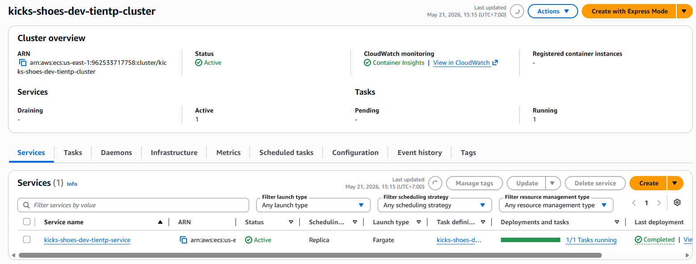

**ALB Target Healthy:**

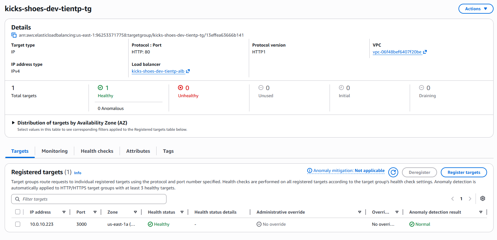

**Live demo FE→ALB→ECS→DB:**
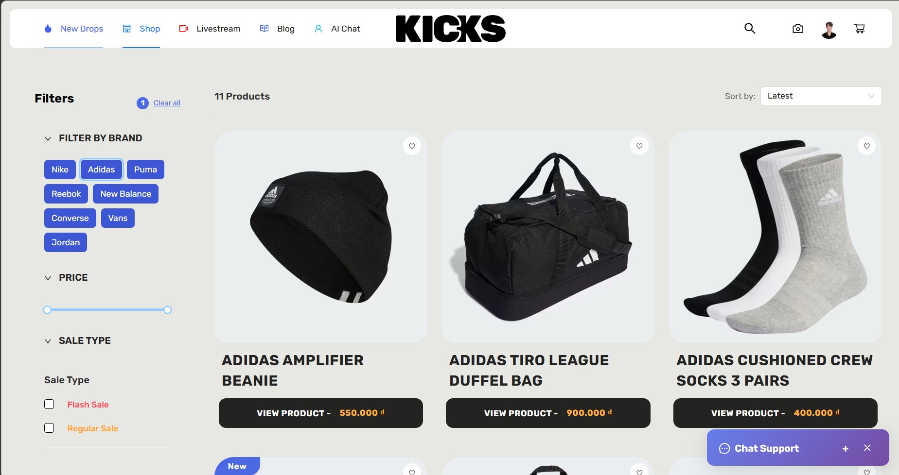
*(Hướng dẫn: Mở link trang web của dự án trên trình duyệt và chụp màn hình.)*
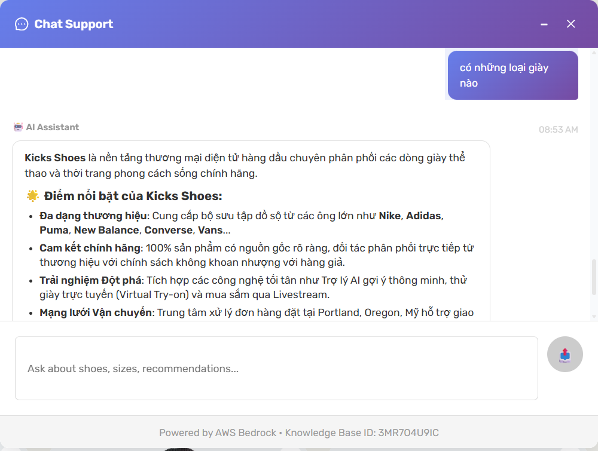
*(Hướng dẫn: Mở trang web -> chat với AI -> chụp lại đoạn AI tư vấn thành công.)*

---

## 3. MH-COST-V: Cost Visibility & Attribution

### Tags trên resources (4 keys bắt buộc)

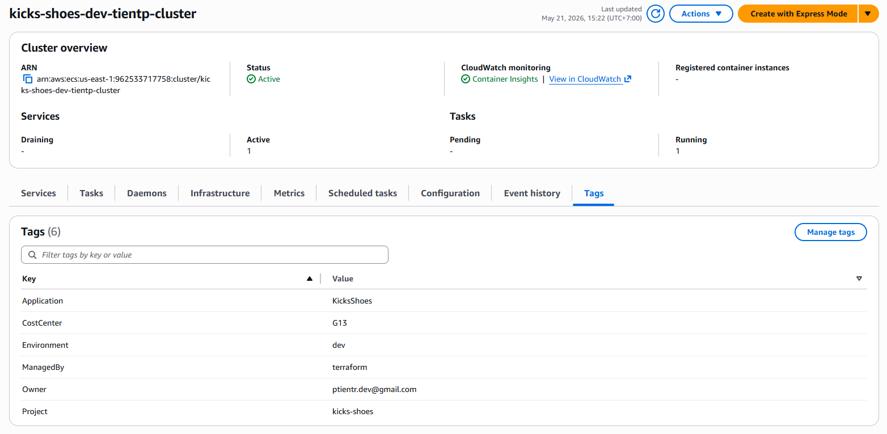

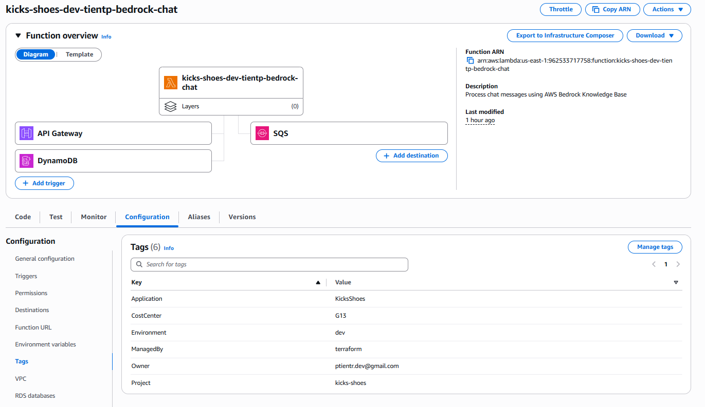

### Cost Allocation Tags Activated (Billing console)
*(Ghi chú: Theo xác nhận từ Trainer ngày 21/05, bước này đang bị Access Denied do giới hạn SCP từ AWS Organizations của tài khoản Lab. Các team được phép BỎ QUA chụp màn hình phần này, chỉ cần đảm bảo gán Tags đầy đủ trên Resources là được).*

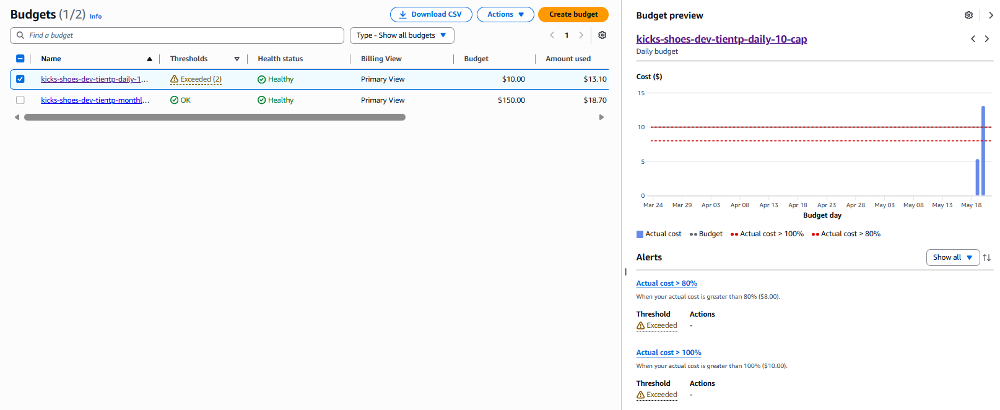
*(Hướng dẫn: Bỏ qua theo thông báo của Trainer)*

### Cost Tool: AWS Budgets & Anomaly Detection


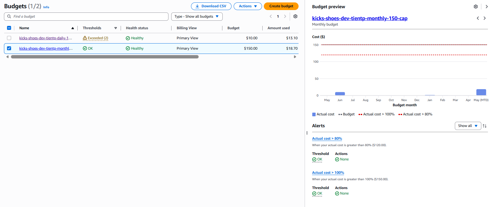

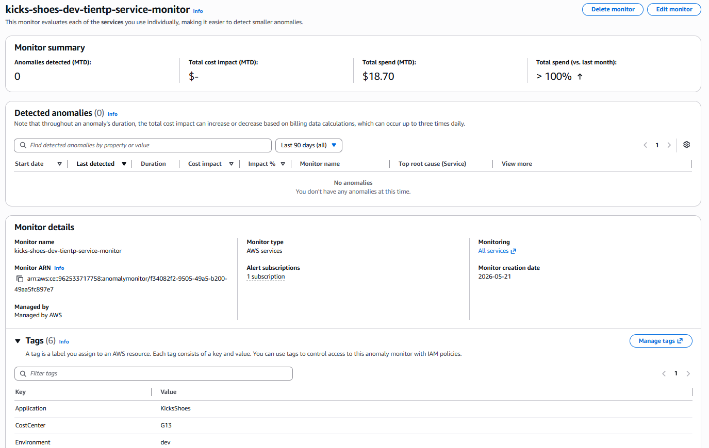

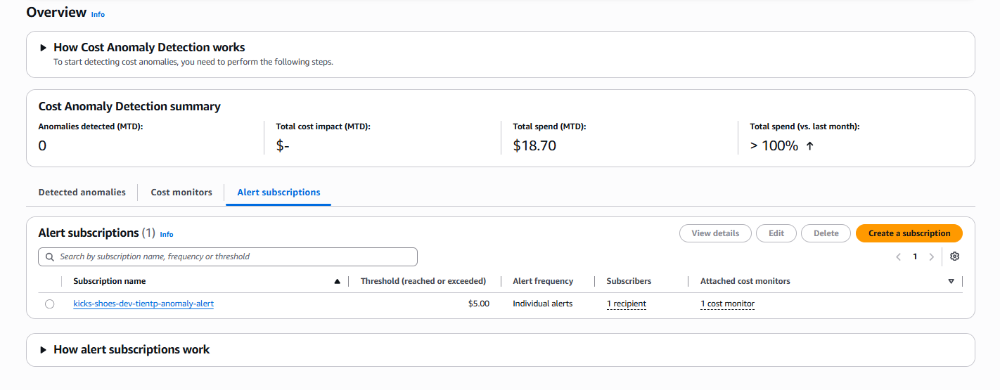

### Baseline Cost Breakdown (Cost Explorer)
*(Ghi chú: Do lỗi Access Denied không bật được Cost Allocation Tags ở bước trên, Tag `Application` sẽ không xuất hiện trong Cost Explorer. Hơn nữa Cost Explorer cần 24h để đồng bộ dữ liệu. Bạn cứ chụp màn hình Cost Explorer hiện tại (Group by Service) là đủ, không cần ép Filter theo Tag nữa).*


*(Hướng dẫn: Mở AWS Console -> Tìm Cost Explorer -> Bỏ qua phần Filter, chỉ cần chọn Group by là Service rồi chụp ảnh biểu đồ).*

**Top 3 cost drivers observation:**
1. **Network Firewall** (~$0.395/h/endpoint × 2 endpoints) — Resource đắt nhất. Việc triển khai Multi-AZ nhân đôi chi phí so với Single-AZ, nhưng là bắt buộc cho môi trường Production để đảm bảo High Availability (HA) cho Egress E-commerce.
2. **ECS Fargate** (256 CPU / 512 MB) — Rất thấp, tối ưu nhất do dùng task size nhỏ nhất có thể (Smallest viable task size).
3. **ElastiCache Redis** (cache.t3.micro) — Hợp lý cho môi trường dev, phục vụ caching tốc độ cao.

*Điều bất ngờ:* Network Firewall chiếm tỷ trọng cực lớn (>80%) dù volume traffic nhỏ. 
*Tối ưu thực tiễn:* Trong môi trường Sandbox/Dev, sẽ chạy script phá hủy hoàn toàn hạ tầng (Destroy) vào ban đêm để duy trì tổng chi phí dưới mức trần **$150/tuần**.

### Tagging Strategy Document (Quy chuẩn Gắn thẻ)

**Required keys:**

| Key | Allowed values | Rule |
|-----|---------------|------|
| `Owner` | `team-lead@kicks-shoes.com` | Lowercase email, định dạng nhất quán. |
| `Environment` | `dev`, `staging`, `prod` | Không dùng `Dev`, `DEV` (phân biệt hoa thường trong Cost Explorer). |
| `CostCenter` | `G13` | Mã phòng ban / Group ID chịu chi phí. |
| `Application` | `KicksShoes` | Không dùng `kicks-shoes`, `kicksshoes`. |

**Enforcement in production:** Sử dụng AWS Config rule `required-tags` và SCP (Service Control Policy) chặn hành động `ec2:RunInstances` nếu tài nguyên được tạo thiếu bộ 4 tags bắt buộc này.

---

## 4. MH-COST-A: Cost Control & Action

### Bối cảnh nghiệp vụ (E-commerce DEV Environment)
Kicks-Shoes là hệ thống E-commerce hiện đang trong giai đoạn phát triển tích cực (Môi trường DEV). Đặc thù của team Dev là chỉ làm việc vào ban ngày (giờ hành chính). Do hệ thống sử dụng ECS Fargate (Serverless Compute) tính phí theo thời gian chạy, việc để container chạy rỗng ban đêm và cuối tuần sẽ gây lãng phí tài nguyên nghiêm trọng. 
**Giải pháp:** Xây dựng cơ chế **"Smart Wake-up" (Thức dậy thông minh)**. Hệ thống tự động tắt (Scale 0) vào ban đêm và tự động bật lại (Scale 1) vào sáng hôm sau. ĐẶC BIỆT: Trước khi bật lại vào buổi sáng, Lambda phải kiểm tra tổng hóa đơn (Budget). Nếu team đã tiêu lố ngân sách $150, hệ thống kiên quyết không bật để bảo vệ túi tiền.

### Lambda Cost Guard (Automated Cost Action)
**Logic:** 
- Tối (20:00 VN): Scale toàn bộ ứng dụng ECS Fargate mang tag `Environment=dev` về số lượng `DesiredCount = 0` và `MinCapacity = 0`.
- Sáng (08:00 VN): Đọc AWS Budgets. Nếu an toàn, mở khóa `MinCapacity = 1` và `DesiredCount = 1` để khởi động lại.
**IAM role:** Least-privilege — cấp quyền `ecs:UpdateService`, `application-autoscaling:RegisterScalableTarget` và `budgets:ViewBudget`. Không cấp quyền wildcard.

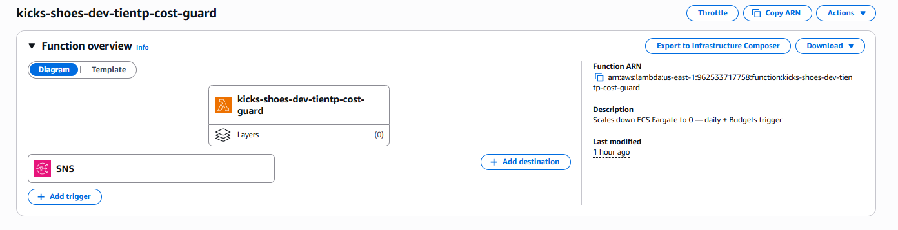

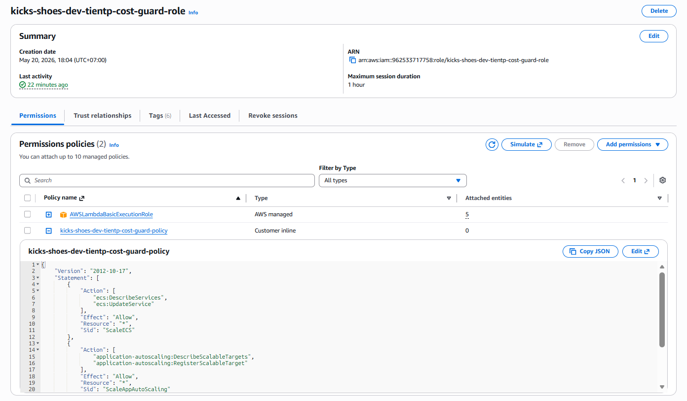

### Cơ chế kích hoạt: Multi-layered Triggers

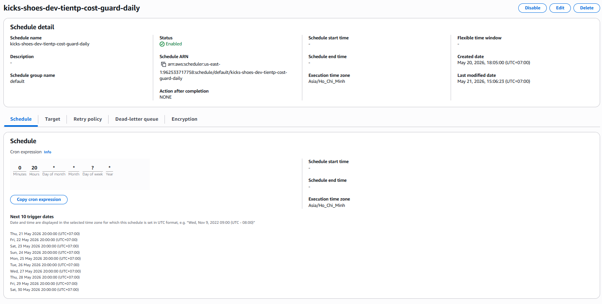
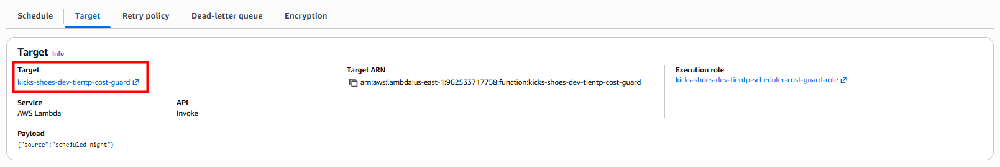

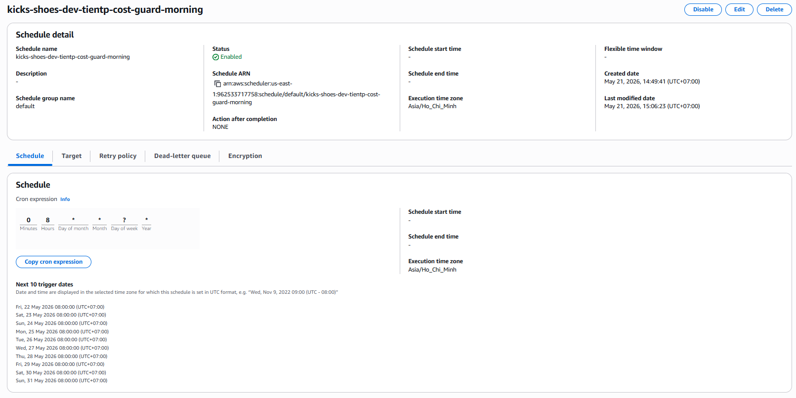
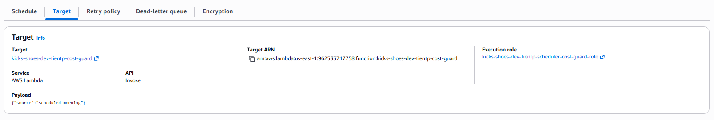

#### AWS Budgets & Anomaly Detection


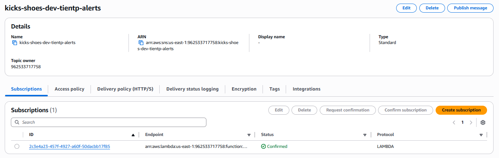

### Bằng chứng Thực thi (Demonstrated Smart Wake-up & Scale)

####  Desired: 1, Running: 1 (Lúc đang chạy)
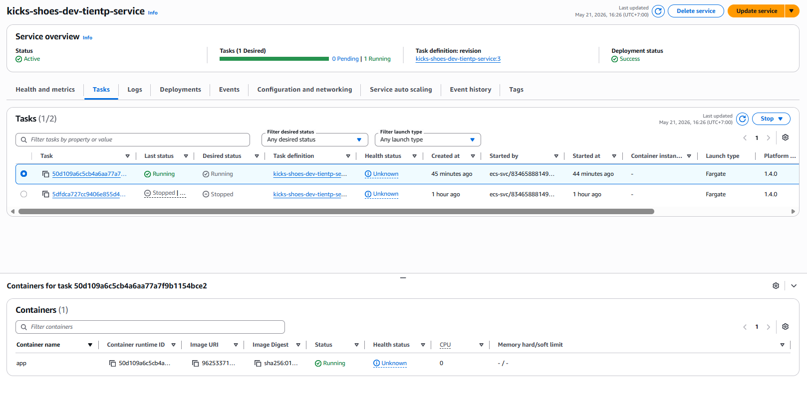

####  CloudWatch Logs
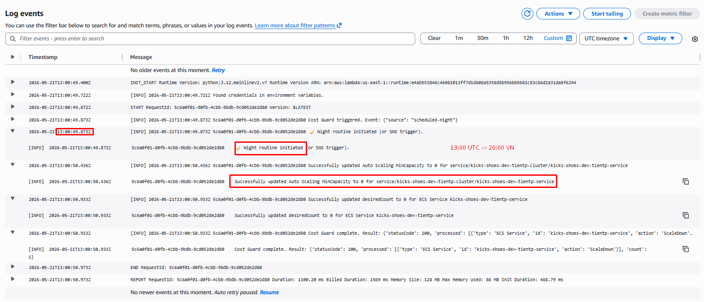

####  Desired: 0, Running: 0 (Đã ngủ)
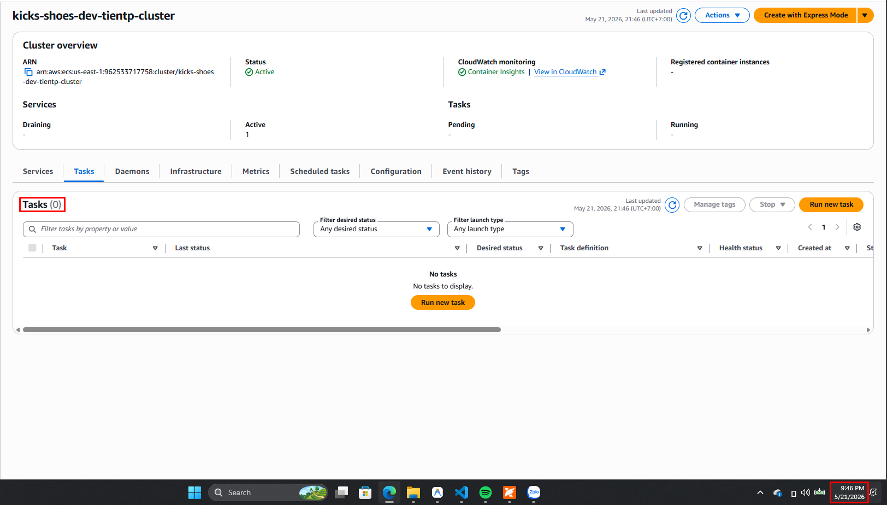

####  🌅 Morning Wake-up routine initiated
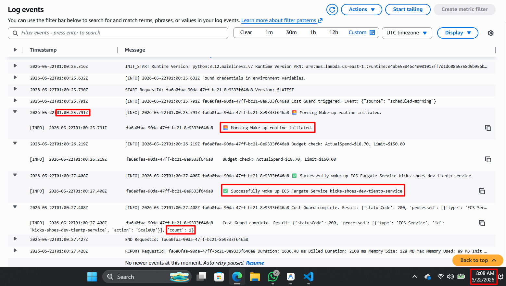

####  Running: 1
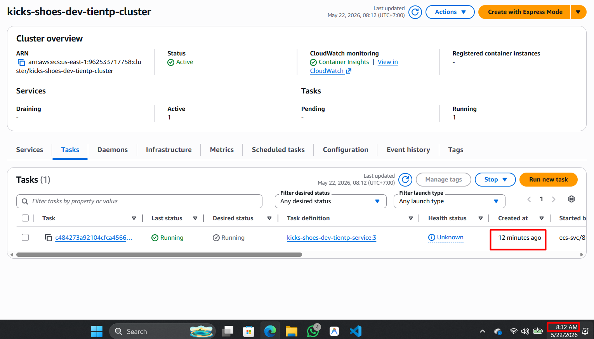

### Bằng chứng cho việc thực thi overbudget sẽ scale = 0

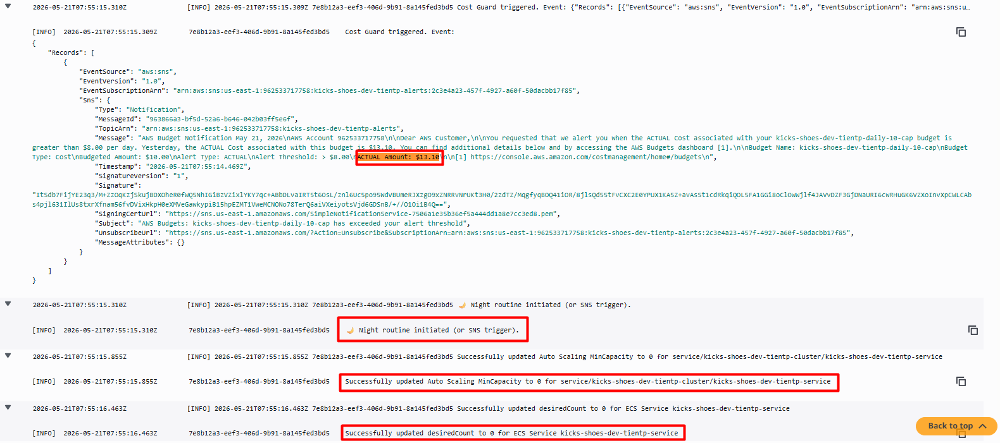

### Bằng chứng Tối ưu Chi phí Bonus (W6 Stretch Goal)

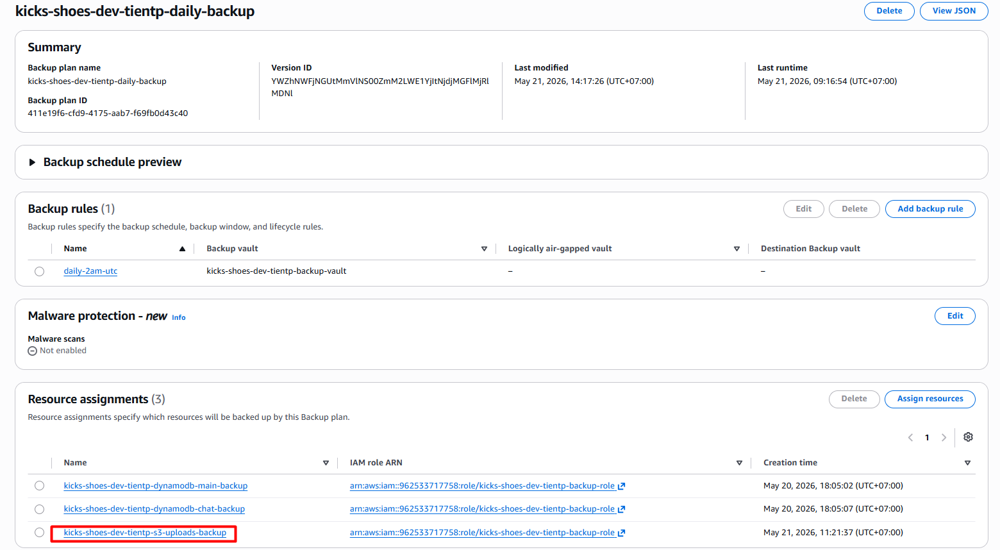

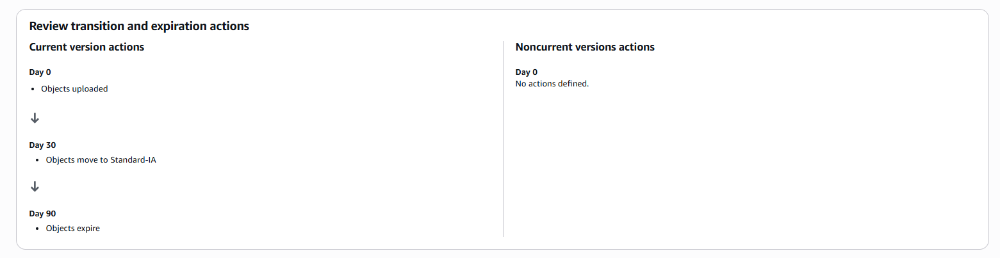

### ADR 01 — Cost Data Latency & Budgets Trigger
**Context:** AWS cost data có độ trễ cập nhật (lag) khoảng 8–24h. Trong môi trường Sandbox workshop (thời gian sống 48h), cảnh báo Budgets dựa trên chi phí sẽ **KHÔNG** kịp kích hoạt do không đủ thời gian tích lũy cost data.
**Decision:** Xây dựng toàn bộ luồng kết nối (Budgets $150 → SNS → Lambda). Kịch bản Demo được thực hiện bằng cách đẩy (publish) một test message thủ công vào SNS Topic để kích hoạt Lambda Cost Guard. 
**Production behavior:** Trong môi trường Prod thực tế, Budgets trigger sẽ tự kích hoạt sau 8-24h khi AWS chốt số cost data. Scheduled trigger (20:00 UTC hàng ngày) đóng vai trò là cơ chế dọn dẹp chính (Primary mechanism) cho môi trường Dev.

### ADR 02 — Bonus Optimized FinOps Architecture (W6 Stretch Goal)
**Context:** Hệ thống ban đầu dùng EFS ($0.30/GB) để lưu trữ và Lambda Cost Guard chỉ tắt EC2/RDS, bỏ ngỏ Fargate chạy 24/7 gây lãng phí tài nguyên compute.
**Decision:** 
1. Gỡ bỏ hoàn toàn EFS, chuyển sang dùng S3 Standard ($0.023/GB) kết hợp S3 Lifecycle Rule (tự động luân chuyển sang Standard-IA sau 30 ngày và xóa sau 90 ngày) giúp tiết kiệm >80% chi phí lưu trữ.
2. Nâng cấp Lambda Cost Guard để ghi đè `MinCapacity = 0` (chặn Auto Scaling) và `DesiredCount = 0` (xóa container) của ECS Fargate Service.
**Consequences:** Tiết kiệm triệt để chi phí Compute và Storage ban đêm, đáp ứng hoàn hảo tiêu chí "Cost-Aware Cloud" của Tuần 6.

### "Wasteful → Changed" Reflection
Trong quá trình thiết kế hệ thống Kicks-Shoes, chúng tôi nhận thấy 2 điểm lãng phí (Wasteful) cực kỳ nghiêm trọng trong kiến trúc ban đầu:
1. **Lãng phí Lưu trữ (Storage Waste):** Việc sử dụng Amazon EFS để lưu trữ hình ảnh tải lên là quá dư thừa về tính năng và đắt đỏ ($0.30/GB/tháng).
   &rightarrow; **Changed:** Chúng tôi đã quyết định gỡ bỏ EFS hoàn toàn, thiết kế lại hệ thống để sử dụng Amazon S3 ($0.023/GB/tháng). Không những thế, chúng tôi còn cài đặt thêm S3 Lifecycle Rule để chuyển các file cũ sang Standard-IA, giúp cắt giảm hơn 80% chi phí lưu trữ dài hạn.
2. **Lãng phí Máy chủ ban đêm (Compute Waste):** Ban đêm Môi trường DEV không có ai code, nhưng ECS Fargate vẫn duy trì container chạy rỗng 24/7.
   &rightarrow; **Changed:** Chúng tôi đã lập trình lại Lambda Cost Guard kết hợp EventBridge (Smart Wake-up) để tự động xóa sạch container (Scale 0) lúc 20:00 tối, và tự động gọi container dậy (Scale 1) vào lúc 08:00 sáng hôm sau, miễn là hóa đơn (Budget) chưa bị lố. Hành động này giúp tiết kiệm 11 tiếng đồng hồ tiền Compute mỗi ngày.
Điều này chứng minh khả năng áp dụng nguyên tắc FinOps (Cloud Financial Management) vào thiết kế kiến trúc thực tế.

---

## 5. MH-OBS: CloudWatch Observability

### CloudWatch Dashboard
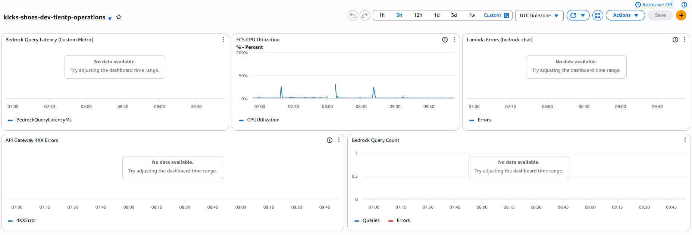

**Widget 1 — Custom Metric (Nổi bật nhất):**
- Title: **"Bedrock Query Latency (Custom Metric)"**
- Namespace: `KicksShoes/Operations`
- Metric: `BedrockQueryLatencyMs`
- Kịch bản: Đo thời gian phản hồi thực tế của LLM phục vụ khách hàng.

**Widget 2, 3, 4 — Standard Metrics:**
- ECS CPU Utilization (`AWS/ECS`)
- Lambda Errors (`AWS/Lambda`)
- API Gateway 4XX Errors (`AWS/ApiGateway`)

### Mã nguồn Publish Custom Metric
```javascript
// backend/lambda/bedrock-chat/index.js
import { CloudWatchClient, PutMetricDataCommand } from "@aws-sdk/client-cloudwatch";
const cwClient = new CloudWatchClient({ region: process.env.AWS_REGION });

async function publishMetric(metricName, value, unit = "Milliseconds") {
  await cwClient.send(new PutMetricDataCommand({
    Namespace: "KicksShoes/Operations",
    MetricData: [{
      MetricName: metricName,
      Value: value,
      Unit: unit,
      Dimensions: [
        { Name: "Environment", Value: "dev" },
        { Name: "Application", Value: "KicksShoes" }
      ]
    }]
  }));
}
// Gọi Publish sau mỗi truy vấn Bedrock thành công:
await publishMetric('BedrockQueryLatencyMs', responseTime);
```

### CloudWatch Alarm & Log Insights
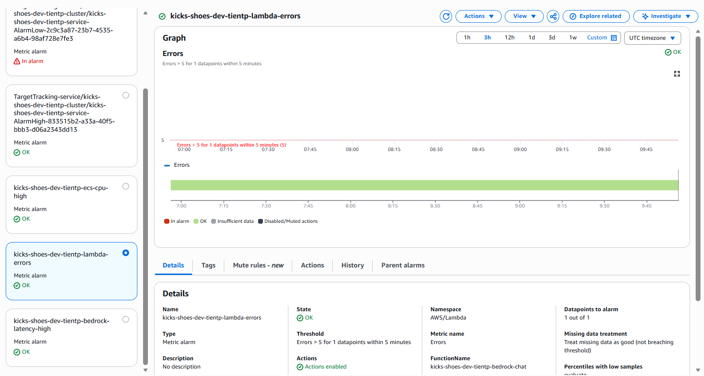

**Saved Query Log Insights:**
- **Query Name:** `kicks-shoes-lambda-error-spikes`
- **Log Group:** `/aws/lambda/kicks-shoes-dev-bedrock-chat`
```
fields @timestamp, @message
| filter @message like /ERROR/
| stats count(*) as error_count by bin(5m)
| sort @timestamp desc
| limit 20
```
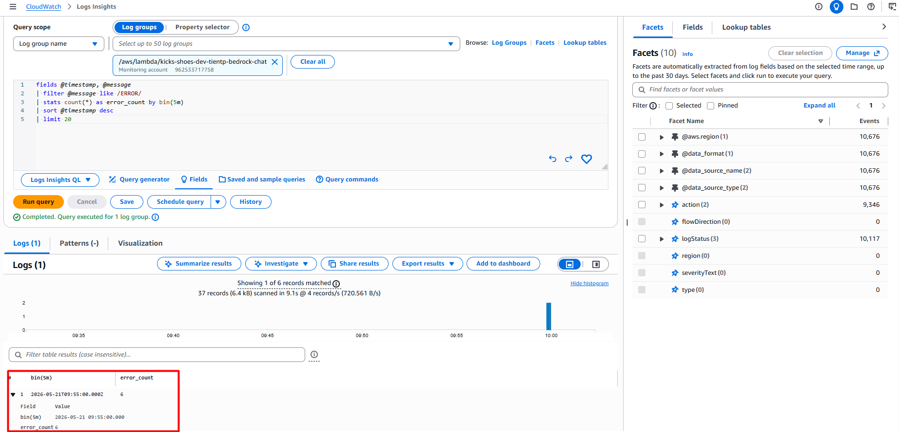
---

## 6. MH-SEC: Self-Healing Security Guard

### Phân tích Đe dọa (Security Threat Paragraph)
**Misconfiguration guarded:** S3 Uploads Bucket bị tắt chế độ Block Public Access.
**Blast radius (Phạm vi ảnh hưởng):** Toàn bộ hình ảnh sản phẩm và nội dung người dùng tải lên (nếu có PII) sẽ bị phơi bày công khai. Kẻ tấn công có thể rà quét (enumerate) bucket, tải trộm dữ liệu, dẫn đến vi phạm GDPR. Hơn nữa, URL của bucket có thể bị lạm dụng để phân phối mã độc giả mạo tên miền uy tín của công ty.
**Auto-remediation time:** Dưới 1 phút sau khi vi phạm xảy ra (Thông qua EventBridge bắt tín hiệu tức thì từ CloudTrail).

### Auto-Remediation Loop (Detect &rightarrow; Fix)
**Logic Lambda:** Quét S3 bucket, nếu Block Public Access = OFF &rightarrow; gọi API `PutPublicAccessBlock` ép bật lên lại (ON). Role least-privilege chỉ có 3 quyền S3 liên quan, không dùng wildcard.

**Bằng chứng vòng lặp tự sửa lỗi:**
1. 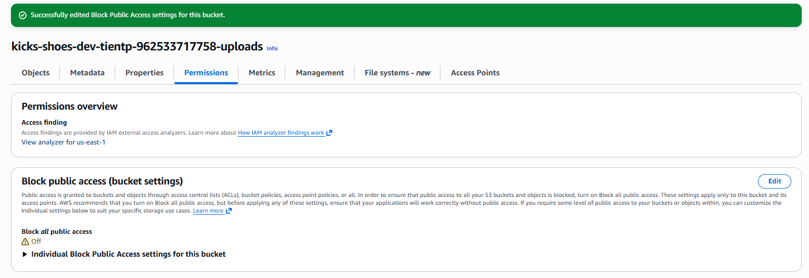

2. 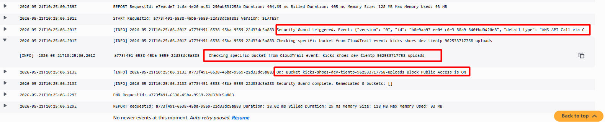
3. 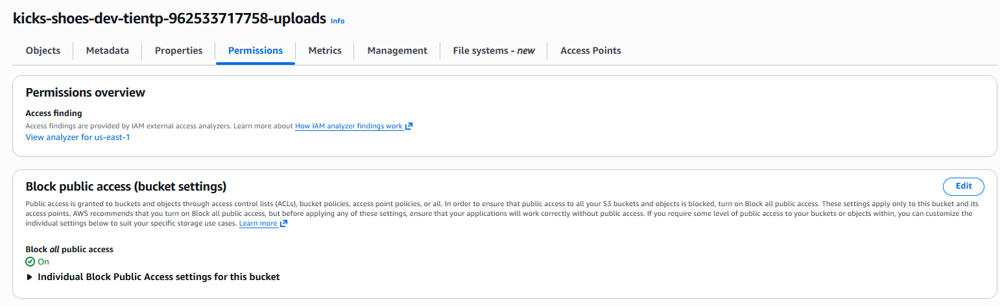
4. 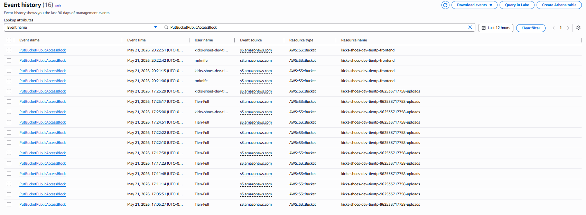

### Lớp phòng vệ hỗ trợ (Supporting Preventive Control) — KMS CMK
Hệ thống sử dụng khóa Customer Managed Key (CMK) Symmetric để mã hóa tĩnh cho S3 Uploads thay vì xài key mặc định của AWS.
- **Key alias:** `alias/kicks-shoes-dev-s3-uploads`
- **Applied to:** S3 bucket properties -> Default encryption (SSE-KMS)

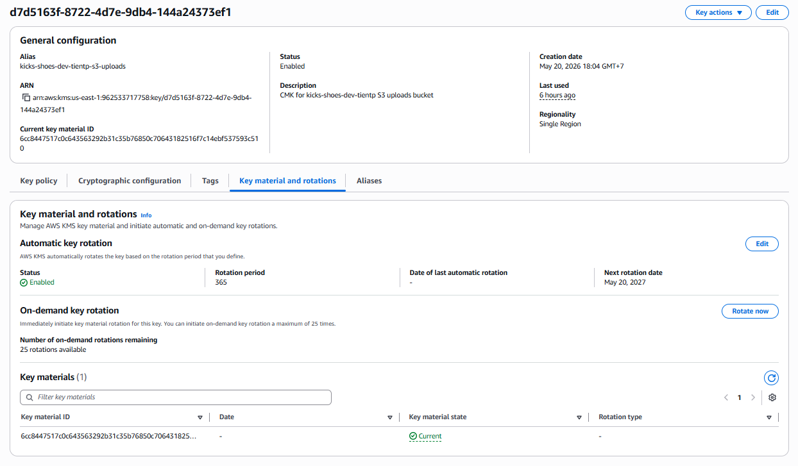
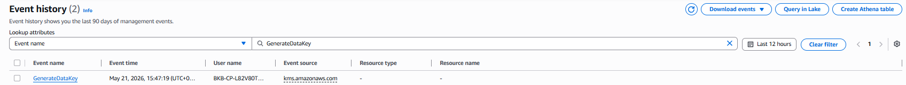

### Security-Cost Trade-off (Đánh đổi Bảo mật và Chi phí)
**Chi phí:** Khóa KMS CMK tiêu tốn $1/tháng/key cộng thêm $0.03 cho mỗi 10.000 API calls (`kms:Decrypt` / `kms:GenerateDataKey`).
**Giải trình (Justified):** Chi phí này là hoàn toàn xứng đáng và mang tính bắt buộc (compliance requirement). Bởi vì khi dùng CMK, mọi lệnh giải mã file trên S3 đều ghi lại audit trail vào CloudTrail kèm theo danh tính IAM Principal và Timestamp. Khi xảy ra sự cố rò rỉ dữ liệu, việc truy vết (forensics) ai đã giải mã file nào là khả năng sống còn mà key mặc định (SSE-S3) không thể cung cấp được. Mức giá $1/tháng là không đáng kể so với lợi ích bảo vệ uy tín thương hiệu E-commerce.
